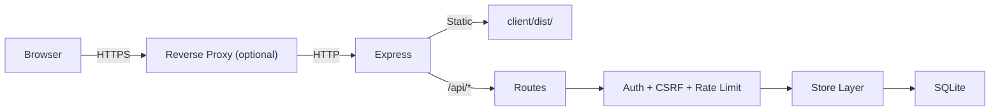
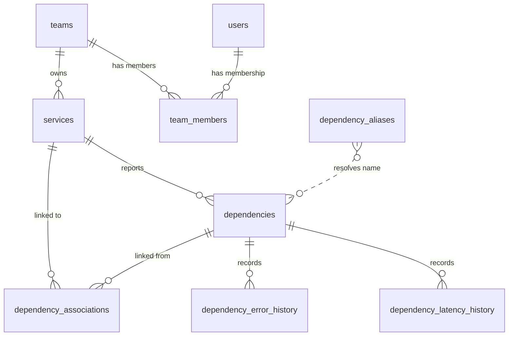
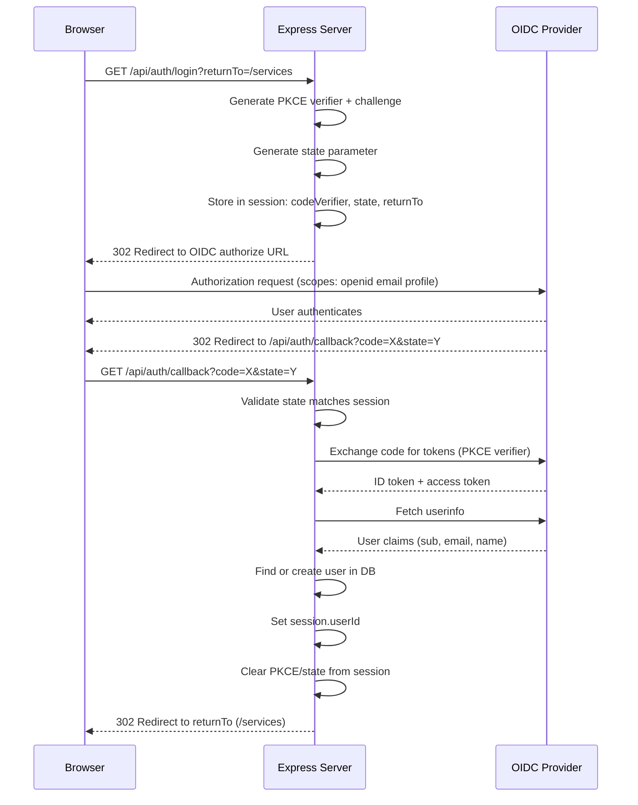
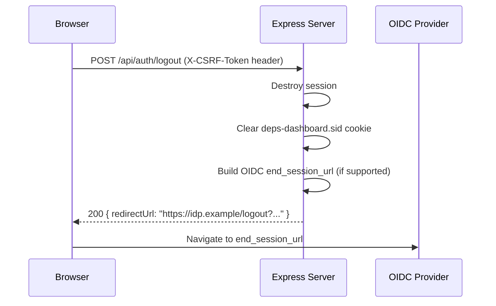
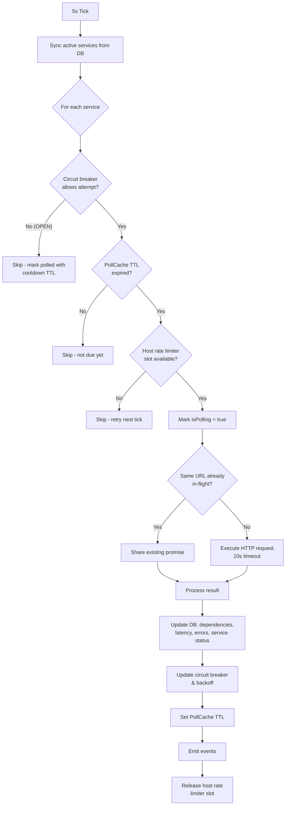
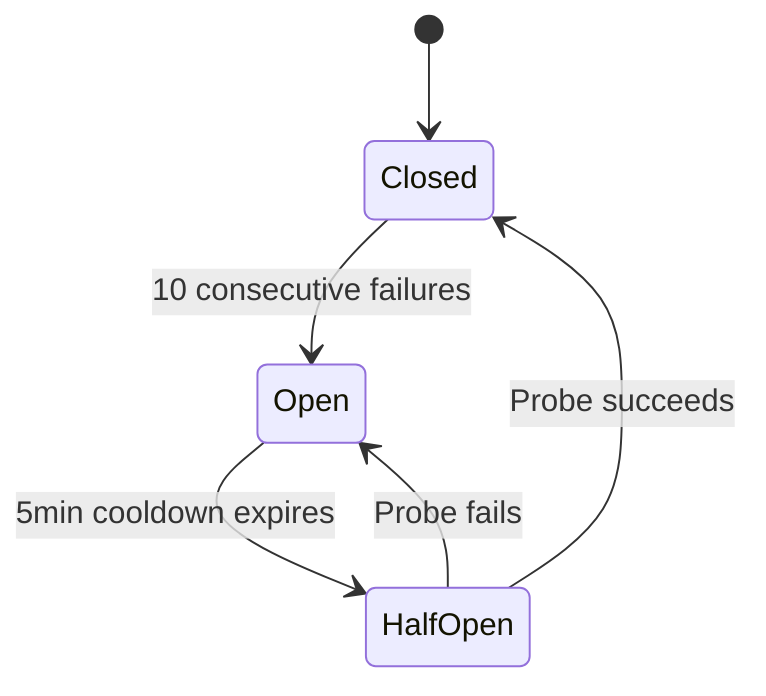
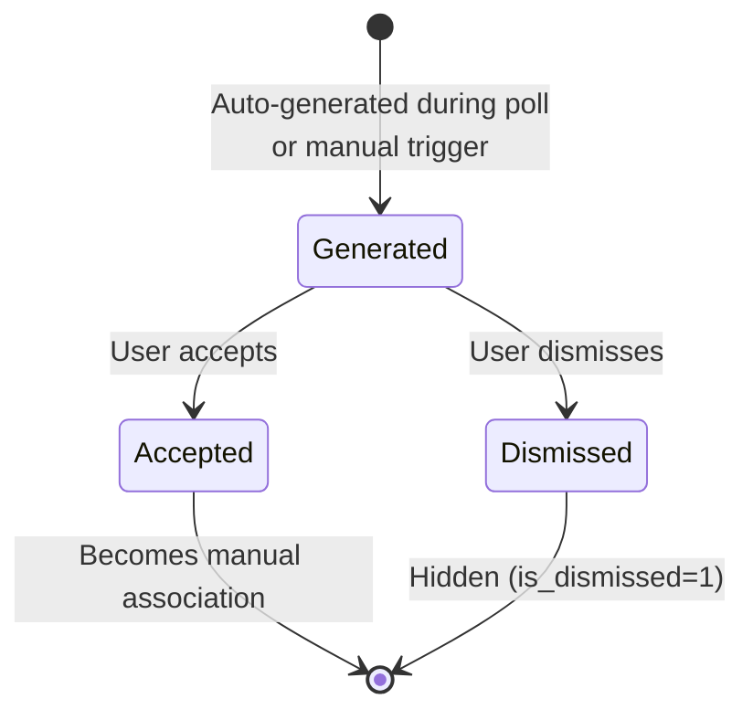

# Depsera Technical Specification

> **Audience:** Developers contributing to Depsera
> **Scope:** Current implementation + 1.0 release target
> **Convention:** Items marked **[Implemented]** exist today. Items marked **[Planned]** are part of the 1.0 roadmap but not yet built.

---

## Table of Contents

- [1. Architecture Overview](#1-architecture-overview)
- [2. Data Model](#2-data-model)
- [3. Authentication & Authorization](#3-authentication--authorization)
- [4. API Reference](#4-api-reference)
- [5. Health Polling System](#5-health-polling-system)
- [6. Dependency Graph](#6-dependency-graph)
- [7. Auto-Suggestion Engine](#7-auto-suggestion-engine)
- [8. SSRF Protection](#8-ssrf-protection)
- [9. Security](#9-security)
- [10. Client Architecture](#10-client-architecture)
- [11. Configuration Reference](#11-configuration-reference)
- [12. Planned Features (1.0)](#12-planned-features-10)

---

## 1. Architecture Overview

**[Implemented]**

Depsera is a monorepo with two packages:

```
depsera/
├── client/    React 18 + TypeScript + Vite SPA
├── server/    Express.js + TypeScript + SQLite REST API
└── package.json   Root scripts (install:all, dev, test, build)
```

### Runtime Topology

**Development:** Two processes — Vite dev server on `:3000` (proxies `/api/*` to backend), Express on `:3001`.

**Production:** Single process — Express serves the built client from `client/dist/` with compression and SPA catch-all routing. No separate web server required.

### Request Flow



All client API calls use cookie-based session authentication. Mutating requests include a CSRF token header. The server communicates with external services only during health polling.

### Key Design Decisions

| Decision | Choice | Rationale |
|---|---|---|
| Database | SQLite (single instance) | Zero external dependencies; store interface pattern enables future migration |
| Session store | SQLite (`better-sqlite3-session-store`) | No additional dependencies; sessions survive restarts |
| Auth | OIDC with PKCE (default) | Enterprise SSO support; PKCE for public clients |
| Polling | Server-side with cache-TTL scheduling | Centralized, consistent polling with resilience patterns |
| Real-time updates | Client-side polling (10–60s intervals) | Sufficient for 1.0; WebSocket deferred |

---

## 2. Data Model

**[Implemented]**

### Database Configuration

- **Engine:** SQLite via `better-sqlite3`
- **Pragmas:** `foreign_keys = ON`, `journal_mode = WAL`
- **Location:** Configurable via `DATABASE_PATH` env var (default: `./data/database.sqlite`)
- **Timestamps:** All stored as ISO-8601 text via `datetime('now')`
- **Booleans:** Stored as `INTEGER` (0 or 1)
- **IDs:** `TEXT` primary keys (UUIDs generated application-side)

### Entity Relationship Diagram



### Table Definitions

#### users

| Column | Type | Constraints | Default |
|---|---|---|---|
| id | TEXT | PRIMARY KEY | |
| email | TEXT | NOT NULL, UNIQUE | |
| name | TEXT | NOT NULL | |
| oidc_subject | TEXT | UNIQUE | NULL |
| password_hash | TEXT | | NULL |
| role | TEXT | NOT NULL, CHECK (`admin`, `user`) | `'user'` |
| is_active | INTEGER | NOT NULL | 1 |
| created_at | TEXT | NOT NULL | `datetime('now')` |
| updated_at | TEXT | NOT NULL | `datetime('now')` |

#### teams

| Column | Type | Constraints | Default |
|---|---|---|---|
| id | TEXT | PRIMARY KEY | |
| name | TEXT | NOT NULL, UNIQUE | |
| description | TEXT | | NULL |
| created_at | TEXT | NOT NULL | `datetime('now')` |
| updated_at | TEXT | NOT NULL | `datetime('now')` |

#### team_members

| Column | Type | Constraints | Default |
|---|---|---|---|
| team_id | TEXT | PK (composite), NOT NULL, FK → teams.id CASCADE | |
| user_id | TEXT | PK (composite), NOT NULL, FK → users.id CASCADE | |
| role | TEXT | NOT NULL, CHECK (`lead`, `member`) | `'member'` |
| created_at | TEXT | NOT NULL | `datetime('now')` |

**Indexes:** `idx_team_members_user_id` on (user_id)

#### services

| Column | Type | Constraints | Default |
|---|---|---|---|
| id | TEXT | PRIMARY KEY | |
| name | TEXT | NOT NULL | |
| team_id | TEXT | NOT NULL, FK → teams.id RESTRICT | |
| health_endpoint | TEXT | NOT NULL | |
| metrics_endpoint | TEXT | | NULL |
| schema_config | TEXT | | NULL |
| poll_interval_ms | INTEGER | NOT NULL | 30000 |
| is_active | INTEGER | NOT NULL | 1 |
| last_poll_success | INTEGER | | NULL |
| last_poll_error | TEXT | | NULL |
| created_at | TEXT | NOT NULL | `datetime('now')` |
| updated_at | TEXT | NOT NULL | `datetime('now')` |

**Indexes:** `idx_services_team_id` on (team_id)

**Constraints:** `poll_interval_ms` validated at API level: min 5000, max 3600000. Team delete is RESTRICT (cannot delete team with services).

#### dependencies

| Column | Type | Constraints | Default |
|---|---|---|---|
| id | TEXT | PRIMARY KEY | |
| service_id | TEXT | NOT NULL, FK → services.id CASCADE | |
| name | TEXT | NOT NULL | |
| canonical_name | TEXT | | NULL |
| description | TEXT | | NULL |
| impact | TEXT | | NULL |
| type | TEXT | CHECK (see below) | `'other'` |
| healthy | INTEGER | | NULL |
| health_state | INTEGER | | NULL |
| health_code | INTEGER | | NULL |
| latency_ms | INTEGER | | NULL |
| check_details | TEXT | | NULL |
| error | TEXT | | NULL |
| error_message | TEXT | | NULL |
| last_checked | TEXT | | NULL |
| last_status_change | TEXT | | NULL |
| created_at | TEXT | NOT NULL | `datetime('now')` |
| updated_at | TEXT | NOT NULL | `datetime('now')` |

**Unique constraint:** `(service_id, name)` — one dependency name per service.

**Indexes:** `idx_dependencies_service_id`, `idx_dependencies_healthy`

**`type` enum:** `database`, `rest`, `soap`, `grpc`, `graphql`, `message_queue`, `cache`, `file_system`, `smtp`, `other`

**`health_state` values:** 0 = OK, 1 = WARNING, 2 = CRITICAL

#### dependency_associations

| Column | Type | Constraints | Default |
|---|---|---|---|
| id | TEXT | PRIMARY KEY | |
| dependency_id | TEXT | NOT NULL, FK → dependencies.id CASCADE | |
| linked_service_id | TEXT | NOT NULL, FK → services.id CASCADE | |
| association_type | TEXT | NOT NULL, CHECK (see below) | `'other'` |
| is_auto_suggested | INTEGER | NOT NULL | 0 |
| confidence_score | INTEGER | | NULL |
| is_dismissed | INTEGER | NOT NULL | 0 |
| created_at | TEXT | NOT NULL | `datetime('now')` |

**Unique constraint:** `(dependency_id, linked_service_id)`

**Indexes:** `idx_dependency_associations_dependency_id`, `idx_dependency_associations_linked_service_id`

**`association_type` enum:** `api_call`, `database`, `message_queue`, `cache`, `other`

#### dependency_latency_history

| Column | Type | Constraints | Default |
|---|---|---|---|
| id | TEXT | PRIMARY KEY | |
| dependency_id | TEXT | NOT NULL, FK → dependencies.id CASCADE | |
| latency_ms | INTEGER | NOT NULL | |
| recorded_at | TEXT | NOT NULL | `datetime('now')` |

**Indexes:** `idx_latency_history_dependency`, `idx_latency_history_time`

#### dependency_error_history

| Column | Type | Constraints | Default |
|---|---|---|---|
| id | TEXT | PRIMARY KEY | |
| dependency_id | TEXT | NOT NULL, FK → dependencies.id CASCADE | |
| error | TEXT | | NULL |
| error_message | TEXT | | NULL |
| recorded_at | TEXT | NOT NULL | `datetime('now')` |

**Indexes:** `idx_error_history_dependency`, `idx_error_history_time`

#### dependency_aliases

| Column | Type | Constraints | Default |
|---|---|---|---|
| id | TEXT | PRIMARY KEY | |
| alias | TEXT | NOT NULL, UNIQUE | |
| canonical_name | TEXT | NOT NULL | |
| created_at | TEXT | NOT NULL | `datetime('now')` |

No foreign keys. Links to `dependencies.canonical_name` by convention.

### Type Enumerations

```typescript
type UserRole = 'admin' | 'user';
type TeamMemberRole = 'lead' | 'member';
type HealthState = 0 | 1 | 2;               // OK | WARNING | CRITICAL
type AggregatedHealthStatus = 'healthy' | 'warning' | 'critical' | 'unknown';
type DependencyType = 'database' | 'rest' | 'soap' | 'grpc' | 'graphql'
                    | 'message_queue' | 'cache' | 'file_system' | 'smtp' | 'other';
type AssociationType = 'api_call' | 'database' | 'message_queue' | 'cache' | 'other';
```

### Planned Schema Changes

#### settings **[Implemented]**

| Column | Type | Constraints | Default |
|---|---|---|---|
| key | TEXT | PRIMARY KEY | |
| value | TEXT | | |
| updated_at | TEXT | NOT NULL | `datetime('now')` |
| updated_by | TEXT | FK → users.id | |

Key-value store for runtime-configurable admin settings. See [Section 12.3](#123-admin-settings).

#### audit_log **[Implemented]**

| Column | Type | Constraints | Default |
|---|---|---|---|
| id | TEXT | PRIMARY KEY | |
| user_id | TEXT | NOT NULL, FK → users.id | |
| action | TEXT | NOT NULL | |
| resource_type | TEXT | NOT NULL | |
| resource_id | TEXT | | |
| details | TEXT | | NULL |
| ip_address | TEXT | | NULL |
| created_at | TEXT | NOT NULL | `datetime('now')` |

**Indexes:** `idx_audit_log_user_id`, `idx_audit_log_created_at`, `idx_audit_log_resource` (resource_type, resource_id)

Records admin actions (role changes, user deactivation/reactivation, team CRUD, team member changes, service CRUD).

#### schema_config (on services) **[Implemented]**

Custom health endpoint schema configuration stored as a nullable `schema_config TEXT` column on the `services` table (JSON string of `SchemaMapping`). Services without a mapping default to proactive-deps format. See [Section 12.5](#125-custom-health-endpoint-schema).

#### alert_channels **[Implemented]**

| Column | Type | Constraints | Default |
|---|---|---|---|
| id | TEXT | PRIMARY KEY | |
| team_id | TEXT | NOT NULL, FK → teams.id CASCADE | |
| channel_type | TEXT | NOT NULL, CHECK (`slack`, `webhook`) | |
| config | TEXT | NOT NULL, JSON | |
| is_active | INTEGER | NOT NULL | 1 |
| created_at | TEXT | NOT NULL | `datetime('now')` |
| updated_at | TEXT | NOT NULL | `datetime('now')` |

**Indexes:** `idx_alert_channels_team_id` on (team_id)

#### alert_rules **[Implemented]**

| Column | Type | Constraints | Default |
|---|---|---|---|
| id | TEXT | PRIMARY KEY | |
| team_id | TEXT | NOT NULL, FK → teams.id CASCADE | |
| severity_filter | TEXT | NOT NULL, CHECK (`critical`, `warning`, `all`) | |
| is_active | INTEGER | NOT NULL | 1 |
| created_at | TEXT | NOT NULL | `datetime('now')` |
| updated_at | TEXT | NOT NULL | `datetime('now')` |

**Indexes:** `idx_alert_rules_team_id` on (team_id)

#### alert_history **[Implemented]**

| Column | Type | Constraints | Default |
|---|---|---|---|
| id | TEXT | PRIMARY KEY | |
| alert_channel_id | TEXT | NOT NULL, FK → alert_channels.id CASCADE | |
| service_id | TEXT | NOT NULL, FK → services.id CASCADE | |
| dependency_id | TEXT | FK → dependencies.id SET NULL | |
| event_type | TEXT | NOT NULL | |
| payload | TEXT | JSON | |
| sent_at | TEXT | NOT NULL | |
| status | TEXT | NOT NULL, CHECK (`sent`, `failed`, `suppressed`) | |

**Indexes:** `idx_alert_history_channel_id` on (alert_channel_id), `idx_alert_history_sent_at` on (sent_at)

#### users.password_hash **[Implemented]**

Nullable `TEXT` column added to `users` table for local auth mode. Stores bcryptjs hashes (12 rounds). Only populated when `LOCAL_AUTH=true`.

### Migration History

| ID | Name | Changes |
|---|---|---|
| 001 | initial_schema | Core tables: users, teams, team_members, services, dependencies, dependency_associations |
| 002 | add_dependency_type | Adds `type` column to dependencies |
| 003 | add_latency_history | Creates dependency_latency_history table |
| 004 | add_check_details_and_errors | Adds check_details, error, error_message to dependencies; creates dependency_error_history |
| 005 | simplify_polling | Adds last_poll_success, last_poll_error to services |
| 006 | add_dependency_aliases | Creates dependency_aliases; adds canonical_name to dependencies |
| 007 | poll_interval_ms | Rebuilds services table: polling_interval (seconds) → poll_interval_ms (milliseconds) |
| 008 | add_audit_log | Creates audit_log table with indexes |
| 009 | add_settings | Creates settings key-value table |
| 010 | add_password_hash | Adds nullable `password_hash TEXT` column to users |
| 011 | add_alerts | Creates alert_channels, alert_rules, alert_history tables with indexes |

Migrations are tracked in a `_migrations` table (`id TEXT PK`, `name TEXT`, `applied_at TEXT`). Each migration runs in a transaction.

---

## 3. Authentication & Authorization

### 3.1 OIDC Authentication Flow **[Implemented]**

Depsera uses OpenID Connect with PKCE (Proof Key for Code Exchange) for authentication. The OIDC client is configured via environment variables.

#### Login Sequence



The first user to authenticate is bootstrapped as `admin`. All subsequent users are created with role `user`.

If the OIDC provider returns updated email/name claims, the user record is updated on each login.

#### Logout Sequence



If the OIDC provider does not support `end_session_endpoint`, the server returns `{ redirectUrl: "/login" }`.

#### Session Data

```typescript
interface SessionData {
  userId: string;           // Set after successful auth
  codeVerifier?: string;    // PKCE — transient during login
  state?: string;           // OAuth state — transient during login
  returnTo?: string;        // Post-login redirect — transient during login
}
```

### 3.2 Auth Bypass Mode **[Removed]**

> **Removed.** Auth bypass mode was removed in favor of `LOCAL_AUTH=true` for local development. Use local auth with `ADMIN_EMAIL`/`ADMIN_PASSWORD` env vars instead. See section 3.7.

### 3.3 Session Configuration **[Implemented]**

| Property | Value |
|---|---|
| Cookie name | `deps-dashboard.sid` |
| Secure | `'auto'` (derives from `req.secure` with trust proxy) |
| HttpOnly | `true` |
| SameSite | `'lax'` (required for OIDC — `'strict'` blocks callback redirect) |
| Path | `/` |
| MaxAge | 24 hours (86,400,000 ms) |
| Store | SQLite via `better-sqlite3-session-store` |
| Expired session cleanup | Every 15 minutes |
| resave | `false` |
| saveUninitialized | `false` |

**Startup warning:** `warnInsecureCookies()` logs a warning if `NODE_ENV` is not `development` and neither `REQUIRE_HTTPS` nor `TRUST_PROXY` is configured, since the `'auto'` secure flag will resolve to `false`, sending cookies over HTTP.

### 3.4 Session Secret Validation **[Implemented]**

On startup, `validateSessionSecret()` checks `SESSION_SECRET`:

**Production (`NODE_ENV=production`)** — server refuses to start if:
- Missing entirely
- Matches a known weak default (`dev-secret-change-in-production`, `dev-session-secret-change-in-production`, `change-me-to-random-32-char-string`)
- Shorter than 32 characters

**Development** — logs warnings but allows weak defaults. Falls back to `'dev-secret-change-in-production'` if unset.

### 3.5 CSRF Protection **[Implemented]**

Uses a double-submit cookie pattern:

1. Server generates a 32-byte random hex token and sets it as the `csrf-token` cookie (`httpOnly: false`, `sameSite: lax`, `secure: req.secure`)
2. Client reads the cookie via `document.cookie` and includes it as the `X-CSRF-Token` header on mutating requests (POST, PUT, DELETE, PATCH)
3. Server middleware validates that the header value matches the cookie value
4. Returns `403 { error: "Invalid or missing CSRF token" }` on mismatch

Safe methods (GET, HEAD, OPTIONS) are exempt from validation.

### 3.6 Role-Based Access Control **[Implemented]**

#### User Roles

| Role | Scope |
|---|---|
| `admin` | Full access to all resources. Bypasses team membership checks. Can manage users, teams, services, and settings. |
| `user` | Access scoped by team membership. Can view all org-wide dashboards (graph, wallboard, dashboard). |

#### Team Member Roles

| Role | Scope |
|---|---|
| `lead` | Can create, edit, delete, and poll services owned by the team. |
| `member` | Read-only access to team resources. |

#### Authorization Middleware

| Middleware | Checks | Sets on `req` |
|---|---|---|
| `requireAuth` | Session has userId, user exists and is active | `req.user` |
| `requireAdmin` | User role is `admin` | — |
| `requireTeamAccess` | User is admin OR member of team (from `req.params.id` or `req.params.teamId`) | `req.teamMembership` |
| `requireTeamLead` | User is admin OR team lead (from params) | `req.teamMembership` |
| `requireServiceTeamAccess` | User is admin OR member of the service's owning team (from `req.params.id`) | `req.teamMembership` |
| `requireServiceTeamLead` | User is admin OR lead of the service's owning team (from `req.params.id`) | `req.teamMembership` |
| `requireBodyTeamLead` | User is admin OR lead of team specified in `req.body.team_id` | `req.teamMembership` |

#### Permissions Object (returned by /api/auth/me)

```typescript
{
  canManageUsers: boolean,      // true if admin
  canManageTeams: boolean,      // true if admin
  canManageServices: boolean    // true if admin OR team lead of any team
}
```

### 3.7 Local Auth **[Implemented]**

A local authentication mode for zero-external-dependency deployment:

- Enabled via `LOCAL_AUTH=true` env var
- Passwords stored with bcryptjs (12 rounds)
- Initial admin created from `ADMIN_EMAIL` / `ADMIN_PASSWORD` env vars on first startup (when no users exist)
- `POST /api/auth/login` accepts `{ email, password }`, sets session, returns user info
- `GET /api/auth/mode` returns `{ mode: "oidc" | "local" }` (public, no auth required)
- Client login page conditionally renders local auth form or OIDC button based on `GET /api/auth/mode` **[Implemented]** (PRO-100)
- Admin can create users and reset passwords via API **[Implemented]** (PRO-101). `POST /api/users` creates a local user; `PUT /api/users/:id/password` resets password. Both gated by `requireLocalAuth`.

---

## 4. API Reference

**[Implemented]** unless noted otherwise.

All endpoints are prefixed with `/api`. All responses are JSON. All mutating requests require the `X-CSRF-Token` header.

### 4.1 Health Check

| Method | Path | Auth | Description |
|---|---|---|---|
| GET | `/api/health` | None | Returns `{ status: "ok" }`. Exempt from HTTPS redirect. |

### 4.2 Authentication

Rate limited: 10 requests/minute per IP.

| Method | Path | Auth | Description |
|---|---|---|---|
| GET | `/api/auth/login` | None | Initiates OIDC flow. Query: `returnTo` (optional). Redirects to OIDC provider. |
| GET | `/api/auth/callback` | None | OIDC callback. Exchanges code for tokens, creates/updates user, redirects to frontend. |
| POST | `/api/auth/logout` | requireAuth | Destroys session. Returns `{ redirectUrl: string }`. |
| GET | `/api/auth/me` | requireAuth | Returns current user profile with teams and permissions. |

**GET /api/auth/me response:**

```json
{
  "id": "uuid",
  "email": "user@example.com",
  "name": "User Name",
  "role": "admin | user",
  "is_active": true,
  "teams": [
    {
      "team_id": "uuid",
      "role": "lead | member",
      "team": { "id": "uuid", "name": "Team Name", "description": "..." }
    }
  ],
  "permissions": {
    "canManageUsers": true,
    "canManageTeams": true,
    "canManageServices": true
  }
}
```

### 4.3 Services

| Method | Path | Auth | Description |
|---|---|---|---|
| GET | `/api/services` | requireAuth | List services. Non-admin: scoped to user's teams. Query: `team_id` (optional filter, validated against membership). |
| GET | `/api/services/:id` | requireAuth | Get service with dependencies and dependent reports. Non-admin: requires team membership. |
| POST | `/api/services` | requireBodyTeamLead | Create service. |
| PUT | `/api/services/:id` | requireServiceTeamLead | Update service. |
| DELETE | `/api/services/:id` | requireServiceTeamLead | Delete service. Returns 204. |
| POST | `/api/services/:id/poll` | requireServiceTeamAccess | Trigger manual poll. Requires team membership (any role). |

**POST /api/services request:**

```json
{
  "name": "string (required)",
  "team_id": "uuid (required)",
  "health_endpoint": "url (required, SSRF-validated)",
  "metrics_endpoint": "url (optional)",
  "schema_config": "SchemaMapping object or null (optional, see Section 12.5)",
  "poll_interval_ms": "number (optional, default 30000, min 5000, max 3600000)"
}
```

**GET /api/services/:id response:**

```json
{
  "id": "uuid",
  "name": "Payment Service",
  "team_id": "uuid",
  "team": { "id": "uuid", "name": "Platform", "description": "..." },
  "health_endpoint": "https://payment-svc/health",
  "metrics_endpoint": null,
  "schema_config": null,
  "poll_interval_ms": 30000,
  "is_active": 1,
  "last_poll_success": 1,
  "last_poll_error": null,
  "created_at": "2024-01-15T10:00:00.000Z",
  "dependencies": [
    {
      "id": "uuid",
      "name": "postgres-main",
      "canonical_name": "PostgreSQL Primary",
      "type": "database",
      "is_healthy": true,
      "latency_ms": 12,
      "error_message": null
    }
  ],
  "dependent_reports": [
    {
      "service_id": "uuid",
      "service_name": "API Gateway",
      "is_healthy": true,
      "dependency_name": "payment-service"
    }
  ]
}
```

**POST /api/services/:id/poll response:**

```json
{
  "success": true,
  "dependencies_updated": 3,
  "status_changes": 1,
  "latency_ms": 245,
  "error": null
}
```

### 4.4 Teams

| Method | Path | Auth | Description |
|---|---|---|---|
| GET | `/api/teams` | requireAuth | List all teams with member/service counts. |
| GET | `/api/teams/:id` | requireAuth | Get team with members and services. |
| POST | `/api/teams` | requireAdmin | Create team. |
| PUT | `/api/teams/:id` | requireAdmin | Update team. |
| DELETE | `/api/teams/:id` | requireAdmin | Delete team. Returns 409 if team has services. |
| POST | `/api/teams/:id/members` | requireAdmin | Add member. Body: `{ user_id, role }`. |
| PUT | `/api/teams/:id/members/:userId` | requireAdmin | Update member role. Body: `{ role }`. |
| DELETE | `/api/teams/:id/members/:userId` | requireAdmin | Remove member. Returns 204. |

**Validation:**
- Team name must be unique (409 Conflict on duplicate)
- Cannot delete team with services (409 Conflict)
- Cannot add existing member (409 Conflict)

### 4.5 Users

| Method | Path | Auth | Description |
|---|---|---|---|
| GET | `/api/users` | requireAdmin | List all users. |
| GET | `/api/users/:id` | requireAdmin | Get user with team memberships. |
| POST | `/api/users` | requireAdmin + requireLocalAuth | Create local user. Body: `{ email, name, password, role? }`. |
| PUT | `/api/users/:id/role` | requireAdmin | Update role. Body: `{ role: "admin" | "user" }`. |
| PUT | `/api/users/:id/password` | requireAdmin + requireLocalAuth | Reset password. Body: `{ password }`. |
| DELETE | `/api/users/:id` | requireAdmin | Deactivate user (soft delete). |
| POST | `/api/users/:id/reactivate` | requireAdmin | Reactivate deactivated user. |

**Guardrails:**
- Cannot demote the last admin (400)
- Cannot deactivate the last active admin (400)
- Deactivating a user removes them from all team memberships
- Create user and password reset return 404 when not in local auth mode
- Password must be at least 8 characters (400)
- Duplicate email returns 409

### 4.6 Aliases

| Method | Path | Auth | Description |
|---|---|---|---|
| GET | `/api/aliases` | requireAuth | List all aliases. |
| POST | `/api/aliases` | requireAuth | Create alias. Body: `{ alias, canonical_name }`. |
| GET | `/api/aliases/canonical-names` | requireAuth | List distinct canonical names. |
| PUT | `/api/aliases/:id` | requireAuth | Update alias. Body: `{ canonical_name }`. |
| DELETE | `/api/aliases/:id` | requireAuth | Delete alias. Returns 204. |

**Note:** Alias read endpoints (`GET`) require `requireAuth`. Alias mutations (`POST`, `PUT`, `DELETE`) require `requireAdmin`. **[Implemented]** (PRO-92).

### 4.7 Associations

| Method | Path | Auth | Description |
|---|---|---|---|
| GET | `/api/dependencies/:depId/associations` | requireAuth | Get associations for dependency (non-dismissed). |
| POST | `/api/dependencies/:depId/associations` | requireAuth | Create manual association. Body: `{ linked_service_id, association_type }`. |
| DELETE | `/api/dependencies/:depId/associations/:serviceId` | requireAuth | Remove association. Returns 204. |
| POST | `/api/dependencies/:depId/suggestions/generate` | requireAuth | Generate suggestions for one dependency. |
| POST | `/api/services/:serviceId/suggestions/generate` | requireAuth | Generate suggestions for all dependencies of a service. |
| GET | `/api/associations/suggestions` | requireAuth | List pending (undismissed) suggestions. |
| POST | `/api/associations/suggestions/:id/accept` | requireAuth | Accept suggestion (converts to manual). |
| POST | `/api/associations/suggestions/:id/dismiss` | requireAuth | Dismiss suggestion. Returns 204. |

**Validation:**
- Cannot link dependency to its own owning service (400)
- Duplicate association returns 409 (unless reactivating a dismissed one)

### 4.8 Graph

| Method | Path | Auth | Description |
|---|---|---|---|
| GET | `/api/graph` | requireAuth | Get dependency graph. Query: `team`, `service`, `dependency` (all optional). |

**Filtering logic (evaluated in order):**
1. If `dependency` specified → subgraph for that dependency
2. Else if `service` specified → service subgraph with upstream traversal
3. Else if `team` specified → team's services and their dependencies
4. Else → full graph of all active services

**Response:**

```json
{
  "nodes": [
    {
      "id": "uuid",
      "type": "service",
      "data": {
        "name": "Payment Service",
        "teamId": "uuid",
        "teamName": "Platform",
        "healthEndpoint": "https://...",
        "isActive": true,
        "dependencyCount": 3,
        "healthyCount": 2,
        "unhealthyCount": 1,
        "lastPollSuccess": true,
        "lastPollError": null,
        "serviceType": "rest",
        "isExternal": false
      }
    }
  ],
  "edges": [
    {
      "id": "sourceId-depId-type",
      "source": "provider-service-id",
      "target": "consumer-service-id",
      "data": {
        "relationship": "depends_on",
        "dependencyType": "database",
        "dependencyName": "postgres-main",
        "dependencyId": "uuid",
        "healthy": true,
        "latencyMs": 12,
        "avgLatencyMs24h": 15.3,
        "associationType": "database",
        "isAutoSuggested": false,
        "confidenceScore": null,
        "impact": "critical",
        "errorMessage": null
      }
    }
  ]
}
```

### 4.9 History

| Method | Path | Auth | Description |
|---|---|---|---|
| GET | `/api/latency/:dependencyId` | requireAuth | Latency stats and recent data points. |
| GET | `/api/latency/:dependencyId/buckets` | requireAuth | Time-bucketed latency data. Query: `range` (1h, 6h, 24h, 7d, 30d; default 24h). **[Implemented]** (PRO-86) |
| GET | `/api/errors/:dependencyId` | requireAuth | Error history with recovery events. |
| GET | `/api/dependencies/:id/timeline` | requireAuth | Health state timeline. Query: `range` (24h, 7d, 30d; default 24h). **[Implemented]** (PRO-86) |

**GET /api/latency/:dependencyId response:**

```json
{
  "dependencyId": "uuid",
  "currentLatencyMs": 12,
  "avgLatencyMs24h": 15.3,
  "minLatencyMs24h": 8,
  "maxLatencyMs24h": 42,
  "dataPointCount": 2880,
  "dataPoints": [
    { "recorded_at": "2024-01-15T10:00:00.000Z", "latency_ms": 12 }
  ]
}
```

Stats are for the last 24 hours. Data points limited to the last 100 records.

**GET /api/errors/:dependencyId response:**

```json
{
  "dependencyId": "uuid",
  "errorCount": 5,
  "errors": [
    {
      "error": { "code": "ECONNREFUSED" },
      "errorMessage": "Connection refused",
      "recordedAt": "2024-01-15T10:00:00.000Z",
      "isRecovery": false
    }
  ]
}
```

Errors are for the last 24 hours, limited to the last 50 records. `isRecovery: true` indicates a recovery event (both `error` and `errorMessage` are null).

**GET /api/latency/:dependencyId/buckets response:** **[Implemented]** (PRO-86)

```json
{
  "dependencyId": "uuid",
  "range": "24h",
  "buckets": [
    { "timestamp": "2024-01-15T10:00:00.000Z", "min": 8, "avg": 15, "max": 42, "count": 12 }
  ]
}
```

Bucket intervals: 1h/6h → 1-minute, 24h → 15-minute, 7d → 1-hour, 30d → 6-hour. Data is aggregated using SQLite `strftime` for efficient server-side bucketing. Returns 400 for invalid range values.

**GET /api/dependencies/:id/timeline response:** **[Implemented]** (PRO-86)

```json
{
  "dependencyId": "uuid",
  "range": "24h",
  "currentState": "healthy",
  "transitions": [
    { "timestamp": "2024-01-15T09:00:00.000Z", "state": "unhealthy" },
    { "timestamp": "2024-01-15T09:05:00.000Z", "state": "healthy" }
  ]
}
```

Transitions derived from `dependency_error_history`: error entries map to `"unhealthy"`, recovery entries (null error) map to `"healthy"`. `currentState` reflects the dependency's current `healthy` column (`"healthy"`, `"unhealthy"`, or `"unknown"` when null). Returns 400 for invalid range values.

### 4.10 Admin

**[Implemented]**

| Method | Path | Auth | Description |
|---|---|---|---|
| GET | `/api/admin/audit-log` | requireAdmin | Paginated audit log. Query: `limit`, `offset`, `startDate`, `endDate`, `userId`, `action`, `resourceType`. |
| GET | `/api/admin/settings` | requireAdmin | Returns all settings with current values and source (`database` or `default`). |
| PUT | `/api/admin/settings` | requireAdmin | Update settings. Body: partial object of `{ key: value }` pairs. Validates values before persisting. |

**GET /api/admin/audit-log response:**

```json
{
  "entries": [
    {
      "id": "uuid",
      "user_id": "uuid",
      "action": "user.role_changed",
      "resource_type": "user",
      "resource_id": "uuid",
      "details": "{\"previousRole\":\"user\",\"newRole\":\"admin\"}",
      "ip_address": "127.0.0.1",
      "created_at": "2024-01-15T10:00:00.000Z",
      "user_email": "admin@example.com",
      "user_name": "Admin User"
    }
  ],
  "total": 42,
  "limit": 50,
  "offset": 0
}
```

**Audit actions:** `user.role_changed`, `user.deactivated`, `user.reactivated`, `team.created`, `team.updated`, `team.deleted`, `team.member_added`, `team.member_removed`, `team.member_role_changed`, `service.created`, `service.updated`, `service.deleted`, `settings.updated`

### 4.11 Alerts

**[Implemented]** (PRO-106)

Team-scoped alert channel, rule, and history management. All endpoints are nested under `/api/teams/:id`.

| Method | Path | Auth | Description |
|---|---|---|---|
| GET | `/api/teams/:id/alert-channels` | requireTeamAccess | List alert channels for team. |
| POST | `/api/teams/:id/alert-channels` | requireTeamLead | Create alert channel. Body: `{ channel_type, config }`. |
| PUT | `/api/teams/:id/alert-channels/:channelId` | requireTeamLead | Update alert channel. Body: `{ channel_type?, config?, is_active? }`. |
| DELETE | `/api/teams/:id/alert-channels/:channelId` | requireTeamLead | Delete alert channel. Returns 204. |
| POST | `/api/teams/:id/alert-channels/:channelId/test` | requireTeamLead | Send test alert to channel. Returns `{ success, error }`. |
| GET | `/api/teams/:id/alert-rules` | requireTeamAccess | Get alert rules for team. |
| PUT | `/api/teams/:id/alert-rules` | requireTeamLead | Upsert alert rule. Body: `{ severity_filter, is_active? }`. |
| GET | `/api/teams/:id/alert-history` | requireTeamAccess | Paginated alert history. Query: `limit`, `offset`, `status`. |

**POST /api/teams/:id/alert-channels request (Slack):**

```json
{
  "channel_type": "slack",
  "config": {
    "webhook_url": "https://hooks.slack.com/services/T00/B00/xxx"
  }
}
```

**POST /api/teams/:id/alert-channels request (Webhook):**

```json
{
  "channel_type": "webhook",
  "config": {
    "url": "https://example.com/webhook",
    "headers": { "Authorization": "Bearer token" }
  }
}
```

**PUT /api/teams/:id/alert-rules request:**

```json
{
  "severity_filter": "critical | warning | all",
  "is_active": true
}
```

**Validation:**
- Slack webhook URL must match `https://hooks.slack.com/services/...`
- Webhook URL must be a valid URL
- Webhook headers must have string values
- `severity_filter` must be `critical`, `warning`, or `all`
- Channel updates verify the channel belongs to the specified team (404 otherwise)

---

## 5. Health Polling System

**[Implemented]**

The polling system is the core engine of Depsera. It runs server-side, polling registered service health endpoints on configurable intervals with resilience patterns to handle failures gracefully.

### 5.1 Polling Lifecycle



**Tick interval:** 5 seconds (`POLL_CYCLE_MS = 5000`). Each tick evaluates which services are due for polling based on their individual `poll_interval_ms` and current backoff state.

**Per-service poll interval:** Configurable via `poll_interval_ms` (default 30,000ms, min 5,000ms, max 3,600,000ms). On success, the next poll is scheduled at this interval. On failure, the interval is extended by the backoff delay.

### 5.2 Circuit Breaker

Each service has an independent circuit breaker instance.



| Parameter | Value |
|---|---|
| Failure threshold | 10 consecutive failures |
| Cooldown period | 300,000ms (5 minutes) |
| Half-open behavior | Allows exactly 1 probe request |

**State transitions:**
- `recordSuccess()` → state = `closed`, failures = 0
- `recordFailure()` → failures++; if failures ≥ 10, state = `open`, record lastFailureTime
- `canAttempt()` → `closed`: always true; `open`: true if elapsed ≥ cooldownMs (transitions to `half-open`); `half-open`: true (allows single probe)

When the circuit is **open**, the PollCache is set with the cooldown duration as TTL, effectively blocking polling for 5 minutes.

### 5.3 Exponential Backoff

Each service has an independent backoff instance.

**Formula:** `delay = min(baseDelayMs × multiplier^attempt, maxDelayMs)`

| Parameter | Value |
|---|---|
| Base delay | 1,000ms |
| Multiplier | 2× |
| Max delay | 300,000ms (5 minutes) |

**Progression:** 1s → 2s → 4s → 8s → 16s → 32s → 64s → 128s → 256s → 300s (capped)

On success, the backoff resets to attempt 0. On failure, the next poll TTL is `max(poll_interval_ms, backoff_delay)`.

### 5.4 PollCache (TTL Scheduling)

In-memory `Map<serviceId, { expiresAt: number }>`.

- `shouldPoll(serviceId)` → true if entry missing or `Date.now() >= expiresAt`
- `markPolled(serviceId, ttlMs)` → sets `expiresAt = Date.now() + ttlMs`
- `invalidate(serviceId)` → deletes entry, forcing poll on next tick

**TTL values by scenario:**
| Scenario | TTL |
|---|---|
| Successful poll | `poll_interval_ms` |
| Failed poll | `max(poll_interval_ms, backoff_delay)` |
| Circuit open | `cooldownMs` (300,000ms) |
| Endpoint changed | Cache invalidated (immediate repoll) |

### 5.5 Host Rate Limiter

Per-hostname concurrency semaphore preventing DDoS amplification.

- **Max concurrent per host:** 3 (configurable via `POLL_MAX_CONCURRENT_PER_HOST`)
- **Mechanism:** `Map<hostname, number>` tracking active poll count
- `acquire(hostname)` → increments count if < max, returns boolean
- `release(hostname)` → decrements count; removes entry if ≤ 0
- **Hostname extraction:** `new URL(url).hostname`

Services that cannot acquire a slot are skipped this tick and automatically retried on the next 5-second tick. There is no explicit retry queue.

### 5.6 Poll Deduplication

Promise coalescing for services sharing the same health endpoint URL.

- **Mechanism:** `Map<url, Promise<PollResult>>` tracking in-flight requests
- If a URL is already being polled, all services sharing that URL await the same promise
- The promise is removed from the map via `.finally()` when the request completes
- Each service maintains independent circuit breaker and backoff state despite sharing the HTTP response
- No cross-cycle caching — each tick triggers fresh requests

### 5.7 Dependency Parsing & Upsert

When a poll succeeds, the health endpoint response is parsed (proactive-deps format) and each dependency is upserted:

1. **Alias resolution:** `aliasStore.resolveAlias(dep.name)` → sets `canonical_name` if alias exists
2. **Upsert:** INSERT or UPDATE on `dependencies` table (conflict key: `service_id, name`). Returns whether the dependency is new and whether health changed.
3. **Status change detection:** If `healthy` value changed, `last_status_change` is updated and a `STATUS_CHANGE` event is emitted.
4. **Error history:** Deduplication logic — only records if the error state changed:
   - Healthy → only record if previous entry was an error (records recovery with null error)
   - Unhealthy → only record if no previous entry, previous was recovery, or error JSON changed
5. **Latency history:** Records data point if `latency_ms > 0`
6. **Auto-suggestions:** For newly created dependencies, `AssociationMatcher.generateSuggestions()` is called (non-blocking, failures swallowed)

### 5.8 Events

| Event | Emitted When | Payload |
|---|---|---|
| `status:change` | Dependency healthy ↔ unhealthy | serviceId, serviceName, dependencyName, previousHealthy, currentHealthy, timestamp |
| `poll:complete` | Poll finishes (success or failure) | serviceId, success, dependenciesUpdated, statusChanges[], error?, latencyMs |
| `poll:error` | Poll fails | serviceId, serviceName, error |
| `service:started` | Service added to polling | serviceId, serviceName |
| `service:stopped` | Service removed from polling | serviceId, serviceName |
| `circuit:open` | Circuit transitions to open | serviceId, serviceName |
| `circuit:close` | Circuit closes from half-open | serviceId, serviceName |

### 5.9 Constants Summary

| Constant | Value | Location |
|---|---|---|
| POLL_CYCLE_MS | 5,000ms | HealthPollingService |
| Circuit failure threshold | 10 | CircuitBreaker |
| Circuit cooldown | 300,000ms (5 min) | CircuitBreaker |
| Backoff base delay | 1,000ms | backoff.ts |
| Backoff multiplier | 2× | backoff.ts |
| Backoff max delay | 300,000ms (5 min) | backoff.ts |
| Poll HTTP timeout | 10,000ms | ServicePoller |
| Default poll interval | 30,000ms | services table default |
| Min poll interval | 5,000ms | API validation |
| Max poll interval | 3,600,000ms (1 hr) | API validation |
| Host concurrency limit | 3 | HostRateLimiter (env: `POLL_MAX_CONCURRENT_PER_HOST`) |

---

## 6. Dependency Graph

**[Implemented]**

### 6.1 Graph Building

The `GraphService` builds graphs by querying services and dependencies, then constructing nodes and edges via `DependencyGraphBuilder`.

**Graph types:**

| Type | Trigger | Behavior |
|---|---|---|
| Full graph | No query params | All active services + all dependencies |
| Team graph | `?team=uuid` | Team's services + external services they depend on |
| Service subgraph | `?service=uuid` | Service + recursive upstream traversal |
| Dependency subgraph | `?dependency=uuid` | Owning service's subgraph |

### 6.2 Node Types

**Service nodes:** Real services registered in Depsera. Include health stats (dependency count, healthy/unhealthy counts, last poll status).

**External nodes:** Virtual nodes for dependencies that have no association to a registered service. Created by `ExternalNodeBuilder`:
- Grouped by normalized dependency name (lowercase + trim)
- ID: `external-{SHA256(normalizedName)[0:12]}`
- Multiple dependencies with the same name produce a single external node with aggregated health stats

### 6.3 Service Type Inference

The `ServiceTypeInferencer` assigns a `serviceType` to each service node based on the most common incoming dependency type. For example, if 3 services list a dependency on "postgres-main" as type `database`, the node for "postgres-main" gets `serviceType: "database"`.

For external nodes, the type is inferred from the most common dependency type in the group.

### 6.4 Edge Construction

Edges represent "depends on" relationships. For each dependency:
- If the dependency has an association (`target_service_id`), the edge connects the associated service to the owning service
- If unassociated, the edge connects the external node to the owning service
- Edge ID format: `{sourceId}-{depId}-{type}` — prevents duplicate edges for the same source→target→type combination

### 6.5 Upstream Traversal

The service subgraph uses `traverseUpstream()` to recursively follow dependency associations:
1. Start with the selected service
2. For each dependency with an association, add the associated service and recurse
3. Track visited services to prevent infinite loops from circular dependencies

---

## 7. Auto-Suggestion Engine

**[Implemented]**

The suggestion engine automatically proposes dependency-to-service associations using 5 matching strategies.

### 7.1 Matching Strategies

Strategies are evaluated in order. For each service, the **highest-scoring** match from any strategy is kept.

| Priority | Strategy | Confidence | Logic |
|---|---|---|---|
| 1 | Exact Name | 100 | `depName === serviceName` (case-insensitive) |
| 2 | Hostname Match | 90 | Hostnames from dependency name and service health endpoint match |
| 3 | Contains Match | 80 | Either name contains the other (case-insensitive) |
| 4 | Token Overlap | 50–90 | Token sets overlap ratio × 40 + 50 |
| 5 | Levenshtein | 50–80 | String similarity × 30 + 50 (min 60% similarity threshold) |

**Minimum confidence threshold:** 50. Matches below this are discarded.

### 7.2 Token Overlap Algorithm

1. Split both names on `-_./` and spaces
2. Filter out single-character tokens
3. Calculate overlap ratio: `overlap / min(set1.size, set2.size)`
4. Confidence: `round(50 + ratio × 40)`

Example: `"user-api-gateway"` vs `"user-api"` → tokens `{user, api, gateway}` vs `{user, api}` → overlap 2, min size 2 → ratio 1.0 → confidence 90.

### 7.3 Levenshtein Algorithm

1. Calculate Levenshtein edit distance between names (case-insensitive)
2. Similarity: `1 - distance / max(len1, len2)`
3. If similarity < 0.6 → no match
4. Confidence: `round(50 + similarity × 30)`

### 7.4 Association Type Inference

The `AssociationTypeInferencer` classifies dependencies by keyword matching in the dependency name:

| Type | Keywords |
|---|---|
| `database` | db, database, postgres, mysql, mongo, redis, sqlite, sql, dynamodb, cassandra, oracle |
| `cache` | cache, redis, memcache, memcached, elasticache |
| `message_queue` | queue, kafka, rabbit, rabbitmq, sqs, pubsub, message, mq, amqp, eventbus, sns |
| `api_call` | api, service, http, rest, grpc, graphql, endpoint |
| `other` | (default fallback) |

Evaluated in order: database → cache → message_queue → api_call → other.

### 7.5 Suggestion Lifecycle



Suggestions are stored as `dependency_associations` rows with `is_auto_suggested = 1`. Accepting a suggestion sets `is_auto_suggested = 0`. Dismissing sets `is_dismissed = 1`.

---

## 8. SSRF Protection

**[Implemented]**

Health endpoint URLs are validated at two points to prevent Server-Side Request Forgery.

### 8.1 Blocked IP Ranges

**IPv4:**

| CIDR | Purpose |
|---|---|
| `0.0.0.0/8` | Current network |
| `10.0.0.0/8` | RFC 1918 private |
| `100.64.0.0/10` | Carrier-grade NAT |
| `127.0.0.0/8` | Loopback |
| `169.254.0.0/16` | Link-local |
| `172.16.0.0/12` | RFC 1918 private |
| `192.0.0.0/24` | IETF protocol assignments |
| `192.0.2.0/24` | TEST-NET-1 |
| `192.168.0.0/16` | RFC 1918 private |
| `198.51.100.0/24` | TEST-NET-2 |
| `203.0.113.0/24` | TEST-NET-3 |
| `224.0.0.0/4` | Multicast |
| `240.0.0.0/4` | Reserved |
| `255.255.255.255/32` | Broadcast |

**IPv6:** `::1` (loopback), `::` (unspecified), `fe80::/10` (link-local), `fc00::/7` (unique local), `::ffff:0:0/96` (IPv4-mapped — validates embedded IPv4)

**Blocked hostnames:** `localhost`, `*.local`, `*.internal`, `*.localhost`

### 8.2 Two-Step Validation

**Step 1: Service creation/update** (`validateUrlHostname`) — synchronous:
- Checks hostname against blocked hostnames
- Validates literal IPs against blocked ranges
- Does NOT perform DNS resolution
- Checks allowlist for bypass

**Step 2: Poll time** (`validateUrlNotPrivate`) — async:
- Repeats all hostname checks from Step 1
- **Performs DNS resolution** to detect DNS rebinding attacks
- Validates resolved IP against blocked ranges
- Checks allowlist for bypass

### 8.3 Allowlist

Configured via `SSRF_ALLOWLIST` env var (comma-separated).

**Supported formats:**
| Format | Example | Matching |
|---|---|---|
| Exact hostname | `localhost` | Case-insensitive exact match |
| Wildcard pattern | `*.internal` | Suffix match (e.g., `service.internal`, `a.b.internal`) |
| CIDR range | `10.0.0.0/8` | Bitwise mask comparison for resolved IPs |

The allowlist is parsed once and cached. Cloud metadata IPs (169.254.169.254) are only allowed if explicitly included.

---

## 9. Security

### 9.1 Security Headers **[Implemented]**

Applied via Helmet middleware on all responses:

| Header | Value |
|---|---|
| Content-Security-Policy | `default-src 'self'`; `style-src 'self' 'unsafe-inline'`; `object-src 'none'`; `frame-ancestors 'none'`. Dev adds `'unsafe-eval'` and `ws:` for Vite HMR. |
| X-Frame-Options | `DENY` |
| X-Content-Type-Options | `nosniff` |
| Strict-Transport-Security | Production only: `max-age=31536000; includeSubDomains` |
| Referrer-Policy | Helmet default (`no-referrer`) |

### 9.2 HTTPS Redirect **[Implemented]**

When `REQUIRE_HTTPS=true`:
- All HTTP requests receive a 301 redirect to HTTPS equivalent
- `/api/health` is exempt (for load balancer probes)
- Requires `TRUST_PROXY` to be set when behind a reverse proxy (so `req.secure` is correct)

### 9.3 Rate Limiting **[Implemented]**

| Limiter | Window | Max Requests | Scope |
|---|---|---|---|
| Global | 15 minutes | 100 per IP | All requests (applied before session middleware) |
| Auth | 1 minute | 10 per IP | `/api/auth` endpoints only |

Returns `429 Too Many Requests` with `RateLimit-*` and `Retry-After` headers.

### 9.4 Redirect Validation **[Implemented]**

Logout redirect URLs are validated client-side via `validateRedirectUrl()`:
- Relative paths allowed (`/services`)
- Same-origin URLs allowed
- External HTTPS URLs allowed (for OIDC end-session endpoints)
- All other URLs rejected (prevents open redirect)

### 9.5 Middleware Application Order **[Implemented]**

The order matters — each layer builds on previous:

| Order | Middleware | Purpose |
|---|---|---|
| 1 | Trust Proxy | Sets `req.secure`, `req.ip` from `X-Forwarded-*` headers |
| 2 | Security Headers | Helmet CSP, X-Frame-Options, etc. |
| 3 | HTTPS Redirect | 301 redirect if enabled |
| 4 | CORS | `credentials: true`, configurable origin |
| 5 | JSON Parser | `express.json()` body parsing |
| 6 | Global Rate Limit | 100 req/15min per IP — early rejection before session creation |
| 7 | Session | Populates `req.session` |
| 8 | Auth Bypass | Dev-only auto-auth |
| 9 | Request Logger | `pino-http` structured logging (method, path, status, response time, userId) |
| 10 | CSRF Protection | Double-submit cookie validation on `/api` routes |
| 11 | Auth Rate Limit | 10 req/1min on `/api/auth` |
| 12 | Route Handlers | API endpoints with auth middleware |
| 13 | Static Files + SPA | Serves `client/dist/` with compression and catch-all |

---

## 10. Client Architecture

**[Implemented]**

### 10.1 Routing

| Path | Component | Auth | Description |
|---|---|---|---|
| `/login` | Login | Public | OIDC redirect or local auth form |
| `/` | Dashboard | Protected | Health summary overview |
| `/services` | ServicesList | Protected | Searchable, filterable service list |
| `/services/:id` | ServiceDetail | Protected | Dependencies, latency, errors, manual poll |
| `/teams` | TeamsList | Protected | Team listing with counts |
| `/teams/:id` | TeamDetail | Protected | Members, roles, owned services |
| `/graph` | DependencyGraph | Protected | Interactive React Flow visualization |
| `/associations` | Associations | Protected | Suggestions inbox, manual creation, aliases |
| `/wallboard` | Wallboard | Protected | Full-screen status board |
| `/admin/users` | UserManagement | Admin only | User accounts, roles, activation |
| `/admin/settings` | AdminSettings | Admin only | Application-wide settings management |

`ProtectedRoute` component checks `isAuthenticated` (redirects to `/login`) and optionally `isAdmin` (redirects to `/`).

### 10.2 Context Providers

**AuthContext** — wraps the entire app:
```typescript
interface AuthContextType {
  user: User | null;
  isLoading: boolean;
  isAuthenticated: boolean;   // user !== null
  isAdmin: boolean;            // user?.role === 'admin'
  login: () => void;           // Redirects to /api/auth/login
  logout: () => Promise<void>; // POST /api/auth/logout with CSRF
  checkAuth: () => Promise<void>; // GET /api/auth/me
}
```
On mount, calls `/api/auth/me` to check session. On logout, validates the redirect URL before navigating.

**ThemeContext** — dark mode support:
```typescript
interface ThemeContextType {
  theme: 'light' | 'dark';
  toggleTheme: () => void;
}
```
Persists to `localStorage` key `theme`. Falls back to system preference (`prefers-color-scheme`). Sets `data-theme` attribute on `<html>`.

### 10.3 API Client Pattern

All API modules follow a consistent pattern:

1. `fetch(url, { credentials: 'include', ... })` — cookie-based auth
2. Mutating requests add `headers: withCsrfToken({ 'Content-Type': 'application/json' })`
3. `handleResponse<T>(response)` — throws `Error` with server message if `!response.ok`, otherwise returns parsed JSON
4. No built-in retry logic — components handle errors via state

**API modules:** `auth.ts`, `services.ts`, `teams.ts`, `users.ts`, `aliases.ts`, `associations.ts`, `graph.ts`, `latency.ts`, `errors.ts`

### 10.4 Custom Hooks

| Hook | Purpose |
|---|---|
| `usePolling` | Auto-refresh with configurable interval (10s, 20s, 30s, 1m). Persists enabled state and interval to localStorage. |
| `useDashboard` | Loads services + teams, computes aggregate stats (total, healthy, warning, critical), team health summaries, issues list, recent activity. |
| `useServicesList` | Loads services + teams with search and team filter. Distinguishes initial load (`isLoading`) from background refresh (`isRefreshing`). |
| `useServiceDetail` | Loads single service + teams. Handles deletion (redirects to `/services`), manual polling. |
| `useTeamDetail` | Loads team + users. Computes available (non-member) users. Handles deletion. |
| `useTeamMembers` | Member CRUD operations — add, toggle role, remove. Tracks in-progress actions per user. |
| `useGraphState` | Complex state management for React Flow graph. Persists node positions per user, layout direction, tier spacing, latency threshold to localStorage. Smart refresh preserves selection state. |
| `useAssociations` | CRUD for associations scoped to a single dependency. |
| `useAliases` | Global alias management — CRUD + canonical names list. |
| `useSuggestions` | Suggestion inbox — list, filter, multi-select, accept/dismiss (individual and bulk). |

### 10.5 Client-Side Storage

| Key | Scope | Content |
|---|---|---|
| `theme` | Global | `'light'` or `'dark'` |
| `graph-node-positions-{userId}` | Per user | JSON map of manually dragged node positions |
| `graph-layout-direction` | Global | `'TB'` or `'LR'` |
| `graph-tier-spacing` | Global | Number (50–500, default 150) |
| `graph-latency-threshold` | Global | Number (0–100, default 80) |
| `{page}-auto-refresh` | Per page | `'true'` or `'false'` |
| `{page}-refresh-interval` | Per page | Interval in ms |
| `wallboard-team-filter` | Wallboard | Selected team ID |
| `wallboard-unhealthy-only` | Wallboard | `'true'` or `'false'` |

---

## 11. Configuration Reference

**[Implemented]**

All configuration is via environment variables on the server (set in `server/.env`).

### 11.1 Core

| Variable | Default | Description |
|---|---|---|
| `PORT` | `3001` | Server listen port |
| `DATABASE_PATH` | `./data/database.sqlite` | SQLite database file path |
| `CORS_ORIGIN` | `http://localhost:3000` | Allowed CORS origin (client URL) |
| `NODE_ENV` | — | `production` enables strict validation |

### 11.2 Authentication

| Variable | Default | Description |
|---|---|---|
| `OIDC_ISSUER_URL` | — | OIDC provider discovery URL |
| `OIDC_CLIENT_ID` | — | OAuth2 client ID |
| `OIDC_CLIENT_SECRET` | — | OAuth2 client secret |
| `OIDC_REDIRECT_URI` | `http://localhost:3001/api/auth/callback` | OAuth2 callback URL |
| `SESSION_SECRET` | weak default in dev | Session signing secret (≥32 chars required in production) |
| ~~`AUTH_BYPASS`~~ | — | **Removed.** Use `LOCAL_AUTH=true` for development instead. |

### 11.3 Security

| Variable | Default | Description |
|---|---|---|
| `TRUST_PROXY` | — | Express trust proxy setting. Accepts: `true`, hop count, IP/subnet, `loopback`, comma-separated list. |
| `REQUIRE_HTTPS` | `false` | `'true'` enables 301 HTTP → HTTPS redirect |
| `SSRF_ALLOWLIST` | — | Comma-separated hostnames, wildcards (`*.internal`), CIDRs (`10.0.0.0/8`) |

### 11.4 Rate Limiting

| Variable | Default | Description |
|---|---|---|
| `RATE_LIMIT_WINDOW_MS` | `900000` (15 min) | Global rate limit window |
| `RATE_LIMIT_MAX` | `100` | Max requests per IP per global window |
| `AUTH_RATE_LIMIT_WINDOW_MS` | `60000` (1 min) | Auth endpoint rate limit window |
| `AUTH_RATE_LIMIT_MAX` | `10` | Max auth requests per IP per window |

### 11.5 Polling

| Variable | Default | Description |
|---|---|---|
| `POLL_MAX_CONCURRENT_PER_HOST` | `3` | Max concurrent polls per target hostname |

### 11.6 Alerting

| Variable | Default | Description |
|---|---|---|
| `APP_BASE_URL` | — | Base URL for deep links in alert messages (e.g., `https://depsera.internal.com`) |

### 11.7 Logging

| Variable | Default | Description |
|---|---|---|
| `LOG_LEVEL` | `info` | Log level: `fatal`, `error`, `warn`, `info`, `debug`, `trace`, `silent` |

**[Implemented]** — Structured JSON logging in production, pretty-printed in development. HTTP requests logged via `pino-http` with method, path, status, response time, and authenticated user ID. Sensitive headers (`Authorization`, `Cookie`, `X-CSRF-Token`, `Set-Cookie`) are redacted from log output. `/api/health` is excluded from request logs by default to reduce noise.

---

## 12. Planned Features (1.0)

All items in this section are **[Planned]**. See the [PRD](./PRD-1.0.md) for full requirements and implementation order.

### 12.1 Security Hardening (Phase 1)

- **SQL injection prevention:** ~~Whitelist allowed `ORDER BY` columns per store query to eliminate string-interpolation vectors.~~ **[Implemented]** (PRO-67).
- **IDOR fixes:** ~~Association routes need team ownership verification (not just `requireAuth`).~~ **[Implemented]** (PRO-91). Alias mutations need `requireAdmin`. **[Implemented]** (PRO-92).
- **Error sanitization:** ~~Replace raw `error.message` in 500 responses with a sanitized utility. Scrub internal URLs/IPs from stored poll error messages.~~ **[Implemented]** (PRO-68). All route handlers use `sendErrorResponse()`. Non-operational errors return generic `{ error: "Internal server error" }`. Poll errors sanitized via `sanitizePollError()` before DB storage.
- **Auth bypass hardening:** ~~Default `AUTH_BYPASS=false` in `.env.example`. Remove committed `.env` from repo. Block bypass in production.~~ **[Implemented then Removed]** (PRO-69). Auth bypass mode was fully removed — `LOCAL_AUTH=true` replaces it for development use.
- **Session cookie improvements:** ~~Evaluate `sameSite: 'strict'` against OIDC callback flow. Add startup warning if `secure` is false outside dev.~~ **[Implemented]** (PRO-70). `sameSite` remains `'lax'` — `'strict'` breaks the OIDC callback flow because the browser won't send the session cookie on the cross-origin redirect from the identity provider, causing PKCE code verifier and state to be unavailable. This is documented in a code comment. CSRF protection (double-submit cookie) mitigates the reduced protection. Cookie path explicitly set to `/`. `warnInsecureCookies()` runs at startup and logs a warning if `secure` will be false outside development (when neither `REQUIRE_HTTPS` nor `TRUST_PROXY` is configured). See `/server/src/auth/session.ts`.
- **Server-side hardening:** Timing-safe OIDC state comparison, explicit body size limits on `express.json()`, session destroy error handling, SQLite WAL pragmas, `eslint-plugin-security`.
- **Client-side hardening:** `URLSearchParams` for query encoding, validate localStorage JSON parsing, `eslint-plugin-security`.
- **HTTP request logging:** ~~Structured logging via `pino` + `pino-http` (method, path, status, response time, user ID). JSON in production, readable in dev. Configurable via `LOG_LEVEL`.~~ **[Implemented]** (PRO-93). All HTTP requests logged via `pino-http` middleware with method, path, status, response time, user ID. Sensitive headers (Authorization, Cookie, X-CSRF-Token) redacted. Health check endpoint optionally excluded from logs. See `/server/src/utils/logger.ts` and `/server/src/middleware/requestLogger.ts`.
- **Audit trail:** ~~`audit_log` table and store. Log admin actions. `GET /api/admin/audit-log` (admin only).~~ **[Implemented]** (PRO-94). `audit_log` table with `AuditLogStore` and fire-and-forget `AuditLogService`. Logs role changes, user deactivation/reactivation, team CRUD, team member changes, and service CRUD. `GET /api/admin/audit-log` endpoint with pagination and filters (date range, action, resource type, user). See `/server/src/services/audit/AuditLogService.ts` and `/server/src/routes/admin/auditLog.ts`.

### 12.2 Team-Scoped Access Control (Phase 2)

- `GET /api/services` returns only the user's team services (unless admin) **[Implemented]** (PRO-97)
- `GET /api/services/:id` requires team membership (or admin) **[Implemented]** (PRO-97)
- `POST /api/services/:id/poll` requires team membership (not just lead) **[Implemented]** (PRO-97)
- Service CRUD restricted to team leads of the owning team **[Implemented]** (existing middleware)
- Graph, wallboard, and dashboard endpoints continue to return all services org-wide **[Implemented]**
- Client adjusts team filter behavior and empty states **[Implemented]** (PRO-98)

### 12.3 Admin Settings (Phase 2–3)

**Backend:** **[Implemented]** (PRO-75). `settings` key-value table with in-memory cache. `GET /api/admin/settings` and `PUT /api/admin/settings` (admin only). Env vars serve as initial defaults; DB settings override at runtime. `SettingsService` singleton provides cache layer with `get()` and `getAll()` methods. Validation rules enforce value ranges per key. See `/server/src/services/settings/SettingsService.ts` and `/server/src/routes/admin/settings.ts`.

**Settings keys:**

| Key | Default | Description |
|---|---|---|
| `data_retention_days` | 365 | Data retention period |
| `retention_cleanup_time` | `"02:00"` | Daily cleanup schedule |
| `default_poll_interval_ms` | 30000 | Default poll interval for new services |
| `ssrf_allowlist` | from env var | SSRF allowlist |
| `global_rate_limit` | 100 | Global rate limit |
| `global_rate_limit_window_minutes` | 15 | Global rate limit window |
| `auth_rate_limit` | 10 | Auth rate limit |
| `auth_rate_limit_window_minutes` | 1 | Auth rate limit window |

**Frontend:** **[Implemented]** (PRO-76). Admin-only `/admin/settings` page with collapsible sections for data retention, polling defaults, security (SSRF allowlist + rate limits), and alerts. Form validation, save confirmation toast, and immediate effect. Admin nav updated with section divider and separate "Users" and "Settings" links. See `/client/src/components/pages/Admin/AdminSettings.tsx`.

### 12.4 Data Retention (Phase 2) **[Implemented]**

- Default retention: 365 days, configurable via `DATA_RETENTION_DAYS` env var and admin settings (`data_retention_days`)
- Scheduled cleanup job runs daily at configurable time (default 02:00 local time, admin setting `retention_cleanup_time`)
- Deletes rows from `dependency_latency_history`, `dependency_error_history`, and `audit_log` older than retention period
- `alert_history` cleanup will be added when alerting is implemented
- Logs number of deleted rows per table
- Runs overdue check on startup (catches up if server was down during scheduled time)
- Graceful shutdown stops the scheduler
- See `DataRetentionService` in `/server/src/services/retention/DataRetentionService.ts`

### 12.5 Custom Health Endpoint Schema (Phase 4)

Support for services that don't use the proactive-deps format:

**Data model:** **[Implemented]** (PRO-78). `schema_config` nullable TEXT column on `services` table (migration 012). Stores a JSON-serialized `SchemaMapping` object. TypeScript types `SchemaMapping`, `FieldMapping`, `BooleanComparison` in `/server/src/db/types.ts`. Validation via `validateSchemaConfig()` in `/server/src/utils/validation.ts` — validates structure, required fields (`name`, `healthy`), optional fields (`latency`, `impact`, `description`), rejects unknown fields. Accepts both JSON strings and objects, returns validated JSON string. Services without a mapping default to proactive-deps format.

**Schema mapping structure:**
```json
{
  "root": "data.healthChecks",
  "fields": {
    "name": "checkName",
    "healthy": { "field": "status", "equals": "ok" },
    "latency": "responseTimeMs",
    "impact": "severity",
    "description": "displayName"
  }
}
```

- `root`: JSON path (dot notation) to the array of dependency checks
- `fields.name`: Direct field mapping (required)
- `fields.healthy`: Direct mapping or boolean comparison (`field` + `equals` value match) (required)
- `fields.latency`, `fields.impact`, `fields.description`: Optional field mappings
- Nested paths supported: `"metrics.responseTime"`
- Services without a mapping default to proactive-deps
- Test endpoint: **[Planned]** `POST /api/services/test-schema` — fetches URL, applies mapping, returns preview
- UI: **[Planned]** Toggle between "proactive-deps" and "Custom schema" on service form, with test button

### 12.6 Alerting (Phase 5)

**Alert channels:** Slack (incoming webhook) and generic HTTP webhook, configured per team.

**Alert API routes:** **[Implemented]** (PRO-106). Team-scoped CRUD for alert channels (`/api/teams/:id/alert-channels`), alert rules (`/api/teams/:id/alert-rules`), and alert history (`/api/teams/:id/alert-history`). Team members can read; team leads+ can create/update/delete. Test endpoint sends a test alert via the configured channel. Input validation for Slack webhook URLs and generic webhook URLs. See `/server/src/routes/alerts/`.

**Alert dispatch:** **[Implemented]** (PRO-82). `AlertService` singleton listens to `STATUS_CHANGE` and `POLL_ERROR` events from the polling system. Evaluates team alert rules with severity filtering (critical only, warning+, or all). Pluggable `IAlertSender` interface for channel type implementations. See `/server/src/services/alerts/AlertService.ts`.

**Flap protection:** **[Implemented]** (PRO-82). `FlapProtector` suppresses repeated alerts for the same dependency within a configurable cooldown (default 5 minutes, admin setting `alert_cooldown_minutes`). In-memory Map keyed by dependencyId (or serviceId for service-level events). See `/server/src/services/alerts/FlapProtector.ts`.

**Rate limiting:** **[Implemented]** (PRO-82). `AlertRateLimiter` enforces per-team hourly alert limits (default 30, admin setting `alert_rate_limit_per_hour`). Windows reset automatically after 1 hour. See `/server/src/services/alerts/AlertRateLimiter.ts`.

**Alert lifecycle:** **[Implemented]** (PRO-82). dispatch → record in `alert_history` (including suppressed) → retry once after 30s on failure. Graceful shutdown flushes pending retries.

**Slack message format:** **[Implemented]** (PRO-83). `SlackSender` implements `IAlertSender`, sending Block Kit-formatted messages to Slack incoming webhooks. Header shows status emoji + service name + Degraded/Recovered. Section shows dependency name + status transition. Context shows severity + timestamp. Actions block includes "View in Depsera" button linking to service detail page (requires `APP_BASE_URL` env var). Poll error events show a warning format with the error message. 10-second request timeout. Handles Slack rate limiting (429) gracefully. Registered in `index.ts` on startup. See `/server/src/services/alerts/senders/SlackSender.ts`.

**Webhook sender:** **[Implemented]** (PRO-84). `WebhookSender` implements `IAlertSender`, sending JSON payloads to generic HTTP webhook URLs. Supports configurable custom headers (for auth tokens, API keys) and configurable HTTP method (POST, PUT, PATCH — default POST). Includes deep link URL via `APP_BASE_URL`. 10-second request timeout. Two event types: `dependency_status_change` and `poll_error`. Registered in `index.ts` on startup. See `/server/src/services/alerts/senders/WebhookSender.ts`.

**Webhook payload (status change):**
```json
{
  "event": "dependency_status_change",
  "service": { "id": "...", "name": "..." },
  "dependency": { "id": "...", "name": "..." },
  "oldStatus": "healthy",
  "newStatus": "critical",
  "severity": "critical",
  "timestamp": "2024-01-15T10:00:00.000Z",
  "url": "https://depsera.internal.com/services/..."
}
```

**Webhook payload (poll error):**
```json
{
  "event": "poll_error",
  "service": { "id": "...", "name": "..." },
  "error": "Connection refused",
  "severity": "critical",
  "timestamp": "2024-01-15T10:00:00.000Z",
  "url": "https://depsera.internal.com/services/..."
}
```

**Alert channel management UI:** **[Implemented]** (PRO-107). `AlertChannels` component integrated into the team detail page. Displays a list of configured alert channels with type icons (Slack/Webhook), truncated webhook URLs, and active/inactive status badges. Team leads and admins can create new channels (Slack webhook or generic HTTP webhook with custom headers and method selection), edit existing channels, toggle enable/disable, test channels (sends a test alert with success/failure feedback), and delete channels with confirmation dialog. Client-side validation enforces Slack webhook URL format and valid URL format. See `client/src/components/pages/Teams/AlertChannels.tsx`, `client/src/hooks/useAlertChannels.ts`, `client/src/api/alerts.ts`, `client/src/types/alert.ts`.

**Alert rules & history UI:** **[Implemented]** (PRO-108). `AlertRules` component on team detail page with severity filter dropdown (Critical only / Warning and above / All status changes) and enable/disable toggle. Team leads and admins see editable form with save button; team members see read-only summary. `AlertHistory` component displays last 50 alerts in reverse chronological order with columns: time, service, dependency, event type, delivery status (sent/failed/suppressed), and channel type. Status filter dropdown for filtering by delivery status. Handles missing/malformed payloads gracefully. See `client/src/components/pages/Teams/AlertRules.tsx`, `client/src/components/pages/Teams/AlertHistory.tsx`, `client/src/hooks/useAlertRules.ts`, `client/src/hooks/useAlertHistory.ts`.

### 12.7 Metrics History Charts (Phase 6)

**API enhancements:** **[Implemented]** (PRO-86)
- `GET /api/latency/:dependencyId/buckets?range=1h|6h|24h|7d|30d` — time-bucketed latency data (`{ buckets: [{ timestamp, min, avg, max, count }] }`). Default range: 24h.
- Bucket sizes: 1h/6h → 1min, 24h → 15min, 7d → 1hr, 30d → 6hr. Efficient SQLite `strftime` aggregation queries.
- `GET /api/dependencies/:id/timeline?range=24h|7d|30d` — health state transitions (`{ transitions: [{ timestamp, state }], currentState }`). Derived from error history (error = unhealthy, recovery = healthy). Default range: 24h.

**Chart components:** **[Implemented]** (PRO-87). Recharts library (`recharts` npm package):
- `LatencyChart` component: line chart with min (green), avg (blue), max (red) lines, custom tooltip with data point count, responsive sizing via `ResponsiveContainer`. Fetches from `/api/latency/:dependencyId/buckets`.
- `HealthTimeline` component: horizontal swimlane bar showing health state periods color-coded green (healthy), red (unhealthy), gray (unknown). Tooltip on hover shows state, time range, and duration. Derived from `/api/dependencies/:id/timeline` transitions.
- `TimeRangeSelector` component: reusable button group supporting any combination of 1h, 6h, 24h, 7d, 30d ranges. Persists selection to localStorage per context via configurable `storageKey`.
- All components support dark mode via CSS custom properties (`--color-chart-min`, `--color-chart-avg`, `--color-chart-max`).
- All components handle loading, error (with retry), and empty states.
- Chart types in `/client/src/types/chart.ts`. API functions in `/client/src/api/latency.ts` and `/client/src/api/timeline.ts`. Components in `/client/src/components/Charts/`.

**Integration:** **[Implemented]** (PRO-88). Service detail page shows per-dependency collapsible panels with latency chart and health timeline. Dashboard shows health distribution bar with percentage healthy, stacked bar visualization, and legend with counts. Charts are self-contained (handle their own data fetching, loading, error, and empty states). Components in `/client/src/components/Charts/` integrated into `ServiceDetail.tsx` and `Dashboard.tsx`.

### 12.8 Local Auth (Phase 3)

- `LOCAL_AUTH=true` env var enables local auth mode
- Passwords: bcrypt, minimum 12 rounds
- Initial admin: `ADMIN_USERNAME` / `ADMIN_PASSWORD` env vars
- `POST /api/auth/login` for credentials-based login
- `GET /api/auth/mode` returns `{ mode: "oidc" | "local" }`
- Client renders login form or OIDC button based on mode **[Implemented]** (PRO-100). Login page calls `GET /api/auth/mode` on mount; shows email/password form in local mode, SSO button in OIDC mode. Auth API client in `client/src/api/auth.ts`.
- Admin can create users and reset passwords **[Implemented]** (PRO-101). `POST /api/users` creates a local user (admin only, local auth mode only). `PUT /api/users/:id/password` resets a user's password. Both endpoints gated by `requireLocalAuth` middleware (returns 404 in non-local modes). Admin user management page shows "Create User" button and per-user "Reset Password" action when in local auth mode.

### 12.9 Deployment (Phase 7)

**Docker:**
- Multi-stage Dockerfile: build stage → minimal Node.js runtime
- `NODE_ENV=production` baked in
- Internal port 3001
- SQLite data as mountable volume (`/data`)
- Health check: `GET /api/health`
- Docker Compose with sensible defaults
- Defaults to local auth if no OIDC config provided

**Documentation:**
- Installation guide (Docker, bare Node, reverse proxy examples)
- Health endpoint spec and custom schema guide
- Admin guide (first-run, user management, alerts, SSRF allowlist)
- API reference with curl examples
- Apache 2.0 license + CLA

---

## Store Layer Reference

### StoreRegistry

Central singleton providing access to all 10 stores:

```typescript
class StoreRegistry {
  public readonly services: IServiceStore;
  public readonly teams: ITeamStore;
  public readonly users: IUserStore;
  public readonly dependencies: IDependencyStore;
  public readonly associations: IAssociationStore;
  public readonly latencyHistory: ILatencyHistoryStore;
  public readonly errorHistory: IErrorHistoryStore;
  public readonly aliases: IDependencyAliasStore;
  public readonly auditLog: IAuditLogStore;
  public readonly settings: ISettingsStore;

  static getInstance(): StoreRegistry;        // Singleton for production
  static create(database): StoreRegistry;     // Scoped instance for testing
}

function getStores(): StoreRegistry;           // Convenience alias
```

### Store Interfaces

#### IServiceStore
```typescript
findById(id: string): Service | undefined
findByIdWithTeam(id: string): ServiceWithTeam | undefined
findAll(options?: ServiceListOptions): Service[]
findAllWithTeam(options?: ServiceListOptions): ServiceWithTeam[]
findActive(): Service[]
findActiveWithTeam(): ServiceWithTeam[]
findByTeamId(teamId: string): Service[]
create(input: ServiceCreateInput): Service
update(id: string, input: ServiceUpdateInput): Service | undefined
delete(id: string): boolean
updatePollResult(serviceId: string, success: boolean, error?: string): void
exists(id: string): boolean
count(options?: ServiceListOptions): number
```

#### ITeamStore
```typescript
findById(id: string): Team | undefined
findByName(name: string): Team | undefined
findAll(): Team[]
create(input: TeamCreateInput): Team
update(id: string, input: TeamUpdateInput): Team | undefined
delete(id: string): boolean
findMembers(teamId: string, options?: TeamMemberListOptions): TeamMemberWithUser[]
getMembership(teamId: string, userId: string): TeamMember | undefined
getMembershipsByUserId(userId: string): MembershipWithTeam[]
addMember(teamId: string, userId: string, role: TeamMemberRole): TeamMember
removeMember(teamId: string, userId: string): boolean
removeAllMembershipsForUser(userId: string): number
updateMemberRole(teamId: string, userId: string, role: TeamMemberRole): boolean
isMember(teamId: string, userId: string): boolean
exists(id: string): boolean
count(): number
getMemberCount(teamId: string): number
getServiceCount(teamId: string): number
```

#### IUserStore
```typescript
findById(id: string): User | undefined
findByEmail(email: string): User | undefined
findByOidcSubject(oidcSubject: string): User | undefined
findAll(options?: ListOptions): User[]
findActive(options?: ListOptions): User[]
create(input: UserCreateInput): User
update(id: string, input: UserUpdateInput): User | undefined
delete(id: string): boolean
exists(id: string): boolean
existsByEmail(email: string): boolean
count(): number
countActiveAdmins(): number
```

#### IDependencyStore
```typescript
findById(id: string): Dependency | undefined
findByServiceId(serviceId: string): Dependency[]
findByServiceIdWithTargets(serviceId: string): DependencyWithTarget[]
findAll(options?: DependencyListOptions): Dependency[]
findAllWithAssociationsAndLatency(options?: { activeServicesOnly?: boolean }): DependencyWithTarget[]
findByServiceIdsWithAssociationsAndLatency(serviceIds: string[]): DependencyWithTarget[]
findExistingByServiceId(serviceId: string): ExistingDependency[]
findDependentReports(serviceId: string): DependentReport[]
upsert(input: DependencyUpsertInput): UpsertResult
delete(id: string): boolean
deleteByServiceId(serviceId: string): number
exists(id: string): boolean
count(options?: DependencyListOptions): number
```

#### IAssociationStore
```typescript
findById(id: string): DependencyAssociation | undefined
findByDependencyId(dependencyId: string): DependencyAssociation[]
findByDependencyIdWithService(dependencyId: string): AssociationWithService[]
findByLinkedServiceId(linkedServiceId: string): DependencyAssociation[]
findPendingSuggestions(): AssociationWithContext[]
existsForDependencyAndService(dependencyId: string, linkedServiceId: string): boolean
create(input: AssociationCreateInput): DependencyAssociation
delete(id: string): boolean
deleteByDependencyId(dependencyId: string): number
acceptSuggestion(id: string): boolean
dismissSuggestion(id: string): boolean
reactivateDismissed(id: string, associationType: AssociationType): boolean
exists(id: string): boolean
count(options?: AssociationListOptions): number
```

#### ILatencyHistoryStore
```typescript
record(dependencyId: string, latencyMs: number, timestamp: string): DependencyLatencyHistory
getStats24h(dependencyId: string): LatencyStats
getAvgLatency24h(dependencyId: string): number | null
getHistory(dependencyId: string, options?: { startTime?: string; endTime?: string; limit?: number }): LatencyDataPoint[]
deleteOlderThan(timestamp: string): number
deleteByDependencyId(dependencyId: string): number
```

#### IErrorHistoryStore
```typescript
record(dependencyId: string, error: string | null, errorMessage: string | null, timestamp: string): DependencyErrorHistory
getErrors24h(dependencyId: string): ErrorHistoryEntry[]
getLastEntry(dependencyId: string): ErrorHistoryEntry | undefined
isDuplicate(dependencyId: string, error: string | null, errorMessage: string | null): boolean
getErrorCount24h(dependencyId: string): number
deleteOlderThan(timestamp: string): number
deleteByDependencyId(dependencyId: string): number
```

#### IDependencyAliasStore
```typescript
findAll(): DependencyAlias[]
findById(id: string): DependencyAlias | undefined
findByAlias(alias: string): DependencyAlias | undefined
getCanonicalNames(): string[]
create(alias: string, canonicalName: string): DependencyAlias
update(id: string, canonicalName: string): DependencyAlias | undefined
delete(id: string): boolean
resolveAlias(name: string): string | null
```

#### IAuditLogStore
```typescript
create(entry: Omit<AuditLogEntry, 'id' | 'created_at'>): AuditLogEntry
findAll(options?: AuditLogListOptions): AuditLogEntryWithUser[]
count(options?: AuditLogListOptions): number
deleteOlderThan(timestamp: string): number
```

#### ISettingsStore
```typescript
findAll(): Setting[]
findByKey(key: string): Setting | undefined
upsert(key: string, value: string | null, updatedBy: string): Setting
upsertMany(entries: Array<{ key: string; value: string | null }>, updatedBy: string): Setting[]
delete(key: string): boolean
```
