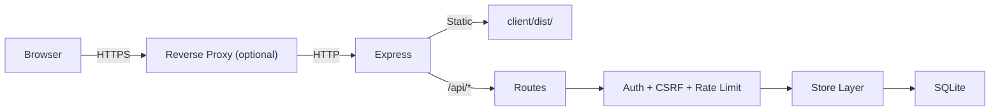

# 1. Architecture Overview

**[Implemented]**

Depsera is a monorepo with two packages:

```
depsera/
├── client/    React 18 + TypeScript + Vite SPA
├── server/    Express.js + TypeScript + SQLite REST API
└── package.json   Root scripts (install:all, dev, test, build)
```

## Runtime Topology

**Development:** Two processes — Vite dev server on `:3000` (proxies `/api/*` to backend), Express on `:3001`.

**Production:** Single process — Express serves the built client from `client/dist/` with compression and SPA catch-all routing. No separate web server required.

## Request Flow



All client API calls use cookie-based session authentication. Mutating requests include a CSRF token header. The server communicates with external services only during health polling.

## Key Design Decisions

| Decision | Choice | Rationale |
|---|---|---|
| Database | SQLite (single instance) | Zero external dependencies; store interface pattern enables future migration |
| Session store | SQLite (`better-sqlite3-session-store`) | No additional dependencies; sessions survive restarts |
| Auth | OIDC with PKCE (default) | Enterprise SSO support; PKCE for public clients |
| Polling | Server-side with cache-TTL scheduling | Centralized, consistent polling with resilience patterns |
| Real-time updates | Client-side polling (10–60s intervals) | Sufficient for 1.0; WebSocket deferred |
