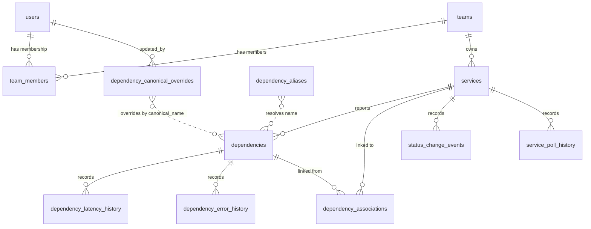

# 2. Data Model

**[Implemented]**

## Database Configuration

- **Engine:** SQLite via `better-sqlite3`
- **Pragmas:** `foreign_keys = ON`, `journal_mode = WAL`
- **Location:** Configurable via `DATABASE_PATH` env var (default: `./data/database.sqlite`)
- **Timestamps:** All stored as ISO-8601 text via `datetime('now')`
- **Booleans:** Stored as `INTEGER` (0 or 1)
- **IDs:** `TEXT` primary keys (UUIDs generated application-side)

## Entity Relationship Diagram



## Table Definitions

### users

| Column | Type | Constraints | Default |
|---|---|---|---|
| id | TEXT | PRIMARY KEY | |
| email | TEXT | NOT NULL, UNIQUE | |
| name | TEXT | NOT NULL | |
| oidc_subject | TEXT | UNIQUE | NULL |
| password_hash | TEXT | | NULL |
| role | TEXT | NOT NULL, CHECK (`admin`, `user`) | `'user'` |
| is_active | INTEGER | NOT NULL | 1 |
| created_at | TEXT | NOT NULL | `datetime('now')` |
| updated_at | TEXT | NOT NULL | `datetime('now')` |

### teams

| Column | Type | Constraints | Default |
|---|---|---|---|
| id | TEXT | PRIMARY KEY | |
| name | TEXT | NOT NULL, UNIQUE | |
| description | TEXT | | NULL |
| created_at | TEXT | NOT NULL | `datetime('now')` |
| updated_at | TEXT | NOT NULL | `datetime('now')` |

### team_members

| Column | Type | Constraints | Default |
|---|---|---|---|
| team_id | TEXT | PK (composite), NOT NULL, FK → teams.id CASCADE | |
| user_id | TEXT | PK (composite), NOT NULL, FK → users.id CASCADE | |
| role | TEXT | NOT NULL, CHECK (`lead`, `member`) | `'member'` |
| created_at | TEXT | NOT NULL | `datetime('now')` |

**Indexes:** `idx_team_members_user_id` on (user_id)

### services

| Column | Type | Constraints | Default |
|---|---|---|---|
| id | TEXT | PRIMARY KEY | |
| name | TEXT | NOT NULL | |
| team_id | TEXT | NOT NULL, FK → teams.id RESTRICT | |
| health_endpoint | TEXT | NOT NULL | |
| metrics_endpoint | TEXT | | NULL |
| schema_config | TEXT | | NULL |
| poll_interval_ms | INTEGER | NOT NULL | 30000 |
| is_active | INTEGER | NOT NULL | 1 |
| last_poll_success | INTEGER | | NULL |
| last_poll_error | TEXT | | NULL |
| poll_warnings | TEXT | | NULL |
| created_at | TEXT | NOT NULL | `datetime('now')` |
| updated_at | TEXT | NOT NULL | `datetime('now')` |

**Indexes:** `idx_services_team_id` on (team_id)

**Constraints:** `poll_interval_ms` validated at API level: min 5000, max 3600000. Team delete is RESTRICT (cannot delete team with services).

### dependencies

| Column | Type | Constraints | Default |
|---|---|---|---|
| id | TEXT | PRIMARY KEY | |
| service_id | TEXT | NOT NULL, FK → services.id CASCADE | |
| name | TEXT | NOT NULL | |
| canonical_name | TEXT | | NULL |
| description | TEXT | | NULL |
| impact | TEXT | | NULL |
| type | TEXT | CHECK (see below) | `'other'` |
| healthy | INTEGER | | NULL |
| health_state | INTEGER | | NULL |
| health_code | INTEGER | | NULL |
| latency_ms | INTEGER | | NULL |
| contact | TEXT | | NULL |
| contact_override | TEXT | | NULL |
| impact_override | TEXT | | NULL |
| check_details | TEXT | | NULL |
| error | TEXT | | NULL |
| error_message | TEXT | | NULL |
| skipped | INTEGER | NOT NULL | 0 |
| last_checked | TEXT | | NULL |
| last_status_change | TEXT | | NULL |
| created_at | TEXT | NOT NULL | `datetime('now')` |
| updated_at | TEXT | NOT NULL | `datetime('now')` |

**Unique constraint:** `(service_id, name)` — one dependency name per service.

**Indexes:** `idx_dependencies_service_id`, `idx_dependencies_healthy`

**`type` enum:** `database`, `rest`, `soap`, `grpc`, `graphql`, `message_queue`, `cache`, `file_system`, `smtp`, `other`

**`health_state` values:** 0 = OK, 1 = WARNING, 2 = CRITICAL

### dependency_associations

| Column | Type | Constraints | Default |
|---|---|---|---|
| id | TEXT | PRIMARY KEY | |
| dependency_id | TEXT | NOT NULL, FK → dependencies.id CASCADE | |
| linked_service_id | TEXT | NOT NULL, FK → services.id CASCADE | |
| association_type | TEXT | NOT NULL, CHECK (see below) | `'other'` |
| is_auto_suggested | INTEGER | NOT NULL | 0 |
| confidence_score | INTEGER | | NULL |
| is_dismissed | INTEGER | NOT NULL | 0 |
| created_at | TEXT | NOT NULL | `datetime('now')` |

**Unique constraint:** `(dependency_id, linked_service_id)`

**Indexes:** `idx_dependency_associations_dependency_id`, `idx_dependency_associations_linked_service_id`

**`association_type` enum:** `api_call`, `database`, `message_queue`, `cache`, `other`

### dependency_latency_history

| Column | Type | Constraints | Default |
|---|---|---|---|
| id | TEXT | PRIMARY KEY | |
| dependency_id | TEXT | NOT NULL, FK → dependencies.id CASCADE | |
| latency_ms | INTEGER | NOT NULL | |
| recorded_at | TEXT | NOT NULL | `datetime('now')` |

**Indexes:** `idx_latency_history_dependency`, `idx_latency_history_time`

### dependency_error_history

| Column | Type | Constraints | Default |
|---|---|---|---|
| id | TEXT | PRIMARY KEY | |
| dependency_id | TEXT | NOT NULL, FK → dependencies.id CASCADE | |
| error | TEXT | | NULL |
| error_message | TEXT | | NULL |
| recorded_at | TEXT | NOT NULL | `datetime('now')` |

**Indexes:** `idx_error_history_dependency`, `idx_error_history_time`

### dependency_canonical_overrides

| Column | Type | Constraints | Default |
|---|---|---|---|
| id | TEXT | PRIMARY KEY | |
| canonical_name | TEXT | NOT NULL, UNIQUE | |
| contact_override | TEXT | | NULL |
| impact_override | TEXT | | NULL |
| created_at | TEXT | NOT NULL | `datetime('now')` |
| updated_at | TEXT | NOT NULL | `datetime('now')` |
| updated_by | TEXT | FK → users.id | NULL |

Stores canonical-level overrides keyed by dependency canonical name. The merge hierarchy is: instance override > canonical override > polled data. `contact_override` is a JSON string (arbitrary contact object). `impact_override` is plain text. `updated_by` tracks who last modified the override for audit purposes.

#### Override Resolution **[Implemented]**

Pure utility functions in `server/src/utils/overrideResolver.ts` resolve effective values from the 3-tier hierarchy. Used by API response layers to compute `effective_contact` and `effective_impact` for each dependency.

**`resolveContact(polled, canonicalOverride, instanceOverride)`** — Field-level merge. Each input is a JSON string (or null). Parses each tier into an object, then spreads: `{ ...polled, ...canonical, ...instance }`. Instance keys win over canonical, which win over polled. Returns merged JSON string, or `null` if all inputs are null/invalid.

**`resolveImpact(polled, canonicalOverride, instanceOverride)`** — First non-null precedence. Returns `instanceOverride` if non-null, else `canonicalOverride` if non-null, else `polled`. Returns `null` if all are null.

Invalid JSON inputs (malformed strings, arrays, primitives) are treated as null and silently skipped during contact merge.

#### Service Detail Integration **[Implemented]**

The batch resolver in `server/src/utils/dependencyOverrideResolver.ts` resolves overrides for a list of dependencies. It fetches all canonical overrides once and builds a lookup map by `canonical_name` for efficient resolution. Each dependency receives `effective_contact` and `effective_impact` computed from its polled data, matching canonical override (if any), and instance overrides. This is applied in `GET /api/services/:id`, `GET /api/services`, and `GET /api/external-services` route handlers before formatting the response. The `DependencyWithResolvedOverrides` type in `server/src/stores/types.ts` extends `Dependency` with these two computed fields.

### dependency_aliases

| Column | Type | Constraints | Default |
|---|---|---|---|
| id | TEXT | PRIMARY KEY | |
| alias | TEXT | NOT NULL, UNIQUE | |
| canonical_name | TEXT | NOT NULL | |
| created_at | TEXT | NOT NULL | `datetime('now')` |

No foreign keys. Links to `dependencies.canonical_name` by convention.

### status_change_events

| Column | Type | Constraints | Default |
|---|---|---|---|
| id | TEXT | PRIMARY KEY | |
| service_id | TEXT | NOT NULL, FK → services.id CASCADE | |
| service_name | TEXT | NOT NULL | |
| dependency_name | TEXT | NOT NULL | |
| previous_healthy | INTEGER | | NULL |
| current_healthy | INTEGER | NOT NULL | |
| recorded_at | TEXT | NOT NULL | `datetime('now')` |

**Indexes:** `idx_status_change_events_time` on (recorded_at), `idx_status_change_events_service` on (service_id)

Records dependency health status transitions detected during polling. `previous_healthy` is NULL for newly discovered dependencies. Used by the dashboard "Recent Activity" and "Most Unstable Dependencies" panels. Subject to data retention cleanup.

### service_poll_history

| Column | Type | Constraints | Default |
|---|---|---|---|
| id | TEXT | PRIMARY KEY | |
| service_id | TEXT | NOT NULL, FK → services.id CASCADE | |
| error | TEXT | | NULL |
| recorded_at | TEXT | NOT NULL | `datetime('now')` |

**Indexes:** `idx_sph_service` on (service_id), `idx_sph_time` on (recorded_at)

Records service-level poll success/failure transitions with deduplication. Only state changes are recorded (success→failure, failure→success, or error message change). A null `error` entry represents recovery (poll succeeded after prior failure). Displayed on the service detail page in the "Poll Issues" section. Subject to data retention cleanup.

## Type Enumerations

```typescript
type UserRole = 'admin' | 'user';
type TeamMemberRole = 'lead' | 'member';
type HealthState = 0 | 1 | 2;               // OK | WARNING | CRITICAL
type AggregatedHealthStatus = 'healthy' | 'warning' | 'critical' | 'unknown';
type DependencyType = 'database' | 'rest' | 'soap' | 'grpc' | 'graphql'
                    | 'message_queue' | 'cache' | 'file_system' | 'smtp' | 'other';
type AssociationType = 'api_call' | 'database' | 'message_queue' | 'cache' | 'other';
```

## Additional Schema

### settings **[Implemented]**

| Column | Type | Constraints | Default |
|---|---|---|---|
| key | TEXT | PRIMARY KEY | |
| value | TEXT | | |
| updated_at | TEXT | NOT NULL | `datetime('now')` |
| updated_by | TEXT | FK → users.id | |

Key-value store for runtime-configurable admin settings.

### audit_log **[Implemented]**

| Column | Type | Constraints | Default |
|---|---|---|---|
| id | TEXT | PRIMARY KEY | |
| user_id | TEXT | NOT NULL, FK → users.id | |
| action | TEXT | NOT NULL | |
| resource_type | TEXT | NOT NULL | |
| resource_id | TEXT | | |
| details | TEXT | | NULL |
| ip_address | TEXT | | NULL |
| created_at | TEXT | NOT NULL | `datetime('now')` |

**Indexes:** `idx_audit_log_user_id`, `idx_audit_log_created_at`, `idx_audit_log_resource` (resource_type, resource_id)

Records admin actions (role changes, user deactivation/reactivation, team CRUD, team member changes, service CRUD, canonical override management, per-instance override management).

**Audit actions:** `user.created`, `user.role_changed`, `user.deactivated`, `user.reactivated`, `user.password_reset`, `team.created`, `team.updated`, `team.deleted`, `team.member_added`, `team.member_removed`, `team.member_role_changed`, `service.created`, `service.updated`, `service.deleted`, `external_service.created`, `external_service.updated`, `external_service.deleted`, `settings.updated`, `canonical_override.upserted`, `canonical_override.deleted`, `dependency_override.updated`, `dependency_override.cleared`

**Resource types:** `user`, `team`, `service`, `external_service`, `settings`, `canonical_override`, `dependency`

### schema_config (on services) **[Implemented]**

Custom health endpoint schema configuration stored as a nullable `schema_config TEXT` column on the `services` table (JSON string of `SchemaMapping`). Services without a mapping default to proactive-deps format.

### alert_channels **[Implemented]**

| Column | Type | Constraints | Default |
|---|---|---|---|
| id | TEXT | PRIMARY KEY | |
| team_id | TEXT | NOT NULL, FK → teams.id CASCADE | |
| channel_type | TEXT | NOT NULL, CHECK (`slack`, `webhook`) | |
| config | TEXT | NOT NULL, JSON | |
| is_active | INTEGER | NOT NULL | 1 |
| created_at | TEXT | NOT NULL | `datetime('now')` |
| updated_at | TEXT | NOT NULL | `datetime('now')` |

**Indexes:** `idx_alert_channels_team_id` on (team_id)

### alert_rules **[Implemented]**

| Column | Type | Constraints | Default |
|---|---|---|---|
| id | TEXT | PRIMARY KEY | |
| team_id | TEXT | NOT NULL, FK → teams.id CASCADE | |
| severity_filter | TEXT | NOT NULL, CHECK (`critical`, `warning`, `all`) | |
| is_active | INTEGER | NOT NULL | 1 |
| created_at | TEXT | NOT NULL | `datetime('now')` |
| updated_at | TEXT | NOT NULL | `datetime('now')` |

**Indexes:** `idx_alert_rules_team_id` on (team_id)

### alert_history **[Implemented]**

| Column | Type | Constraints | Default |
|---|---|---|---|
| id | TEXT | PRIMARY KEY | |
| alert_channel_id | TEXT | NOT NULL, FK → alert_channels.id CASCADE | |
| service_id | TEXT | NOT NULL, FK → services.id CASCADE | |
| dependency_id | TEXT | FK → dependencies.id SET NULL | |
| event_type | TEXT | NOT NULL | |
| payload | TEXT | JSON | |
| sent_at | TEXT | NOT NULL | |
| status | TEXT | NOT NULL, CHECK (`sent`, `failed`, `suppressed`) | |

**Indexes:** `idx_alert_history_channel_id` on (alert_channel_id), `idx_alert_history_sent_at` on (sent_at)

### users.password_hash **[Implemented]**

Nullable `TEXT` column added to `users` table for local auth mode. Stores bcryptjs hashes (12 rounds). Only populated when `LOCAL_AUTH=true`.

## Migration History

| ID | Name | Changes |
|---|---|---|
| 001 | initial_schema | Core tables: users, teams, team_members, services, dependencies, dependency_associations |
| 002 | add_dependency_type | Adds `type` column to dependencies |
| 003 | add_latency_history | Creates dependency_latency_history table |
| 004 | add_check_details_and_errors | Adds check_details, error, error_message to dependencies; creates dependency_error_history |
| 005 | simplify_polling | Adds last_poll_success, last_poll_error to services |
| 006 | add_dependency_aliases | Creates dependency_aliases; adds canonical_name to dependencies |
| 007 | poll_interval_ms | Rebuilds services table: polling_interval (seconds) → poll_interval_ms (milliseconds) |
| 008 | add_audit_log | Creates audit_log table with indexes |
| 009 | add_settings | Creates settings key-value table |
| 010 | add_password_hash | Adds nullable `password_hash TEXT` column to users |
| 011 | add_alerts | Creates alert_channels, alert_rules, alert_history tables with indexes |
| 012 | add_schema_config | Adds nullable `schema_config TEXT` column to services |
| 013 | add_external_services | Adds `is_external`, `description` columns to services |
| 014 | add_match_reason | Adds `match_reason TEXT` column to dependency_associations |
| 015 | relax_dependency_type | Removes CHECK constraint on dependencies.type, allows arbitrary strings |
| 016 | add_contact_column | Adds nullable `contact TEXT` column to dependencies for storing polled contact JSON |
| 017 | add_instance_overrides | Adds nullable `contact_override TEXT` and `impact_override TEXT` columns to dependencies for user-managed per-instance overrides |
| 018 | add_canonical_overrides | Creates `dependency_canonical_overrides` table keyed by `canonical_name` (unique) with `contact_override`, `impact_override`, and `updated_by` FK to users |
| 019 | add_status_change_events | Creates `status_change_events` table for persisting dependency health transitions |
| 020 | add_service_poll_history | Creates `service_poll_history` table for tracking service-level poll success/failure transitions |
| 021 | add_performance_indexes | Adds performance indexes for common query patterns |
| 022 | add_poll_warnings | Adds nullable `poll_warnings TEXT` column to services for storing schema mapping warnings as JSON array |
| 023 | add_skipped_column | Adds `skipped INTEGER NOT NULL DEFAULT 0` column to dependencies |

Migrations are tracked in a `_migrations` table (`id TEXT PK`, `name TEXT`, `applied_at TEXT`). Each migration runs in a transaction.
