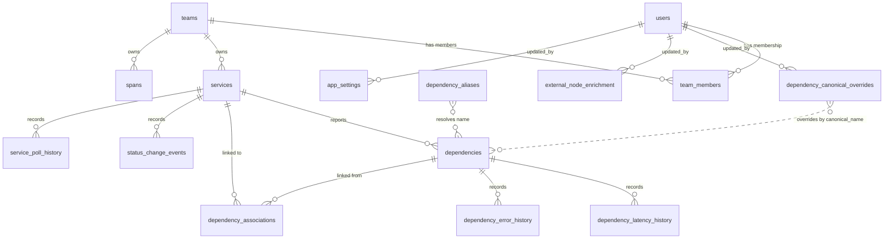

# 2. Data Model

**[Implemented]**

## Database Configuration

- **Engine:** SQLite via `better-sqlite3`
- **Pragmas:** `foreign_keys = ON`, `journal_mode = WAL`
- **Location:** Configurable via `DATABASE_PATH` env var (default: `./data/database.sqlite`)
- **Timestamps:** All stored as ISO-8601 text via `datetime('now')`
- **Booleans:** Stored as `INTEGER` (0 or 1)
- **IDs:** `TEXT` primary keys (UUIDs generated application-side)

## Entity Relationship Diagram


```mermaid
erDiagram
    users ||--o{ team_members : "has membership"
    teams ||--o{ team_members : "has members"
    teams ||--o{ services : "owns"
    teams ||--o{ spans : "owns"
    services ||--o{ dependencies : "reports"
    dependencies ||--o{ dependency_latency_history : "records"
    dependencies ||--o{ dependency_error_history : "records"
    dependencies ||--o{ dependency_associations : "linked from"
    services ||--o{ dependency_associations : "linked to"
    dependency_aliases }o..o{ dependencies : "resolves name"
    dependency_canonical_overrides }o..o{ dependencies : "overrides by canonical_name"
    users ||--o{ dependency_canonical_overrides : "updated_by"
    users ||--o{ external_node_enrichment : "updated_by"
    users ||--o{ app_settings : "updated_by"
    services ||--o{ status_change_events : "records"
    services ||--o{ service_poll_history : "records"
```

## Table Definitions

### users

| Column | Type | Constraints | Default |
|---|---|---|---|
| id | TEXT | PRIMARY KEY | |
| email | TEXT | NOT NULL, UNIQUE | |
| name | TEXT | NOT NULL | |
| oidc_subject | TEXT | UNIQUE | NULL |
| password_hash | TEXT | | NULL |
| role | TEXT | NOT NULL, CHECK (`admin`, `user`) | `'user'` |
| is_active | INTEGER | NOT NULL | 1 |
| created_at | TEXT | NOT NULL | `datetime('now')` |
| updated_at | TEXT | NOT NULL | `datetime('now')` |

### teams

| Column | Type | Constraints | Default |
|---|---|---|---|
| id | TEXT | PRIMARY KEY | |
| name | TEXT | NOT NULL, UNIQUE | |
| key | TEXT | UNIQUE (partial, WHERE key IS NOT NULL) | NULL |
| description | TEXT | | NULL |
| contact | TEXT | | NULL |
| created_at | TEXT | NOT NULL | `datetime('now')` |
| updated_at | TEXT | NOT NULL | `datetime('now')` |

**contact:** JSON string of key-value pairs (e.g. `{"email":"team@example.com","slack":"#team-channel"}`). Nullable.

### team_members

| Column | Type | Constraints | Default |
|---|---|---|---|
| team_id | TEXT | PK (composite), NOT NULL, FK → teams.id CASCADE | |
| user_id | TEXT | PK (composite), NOT NULL, FK → users.id CASCADE | |
| role | TEXT | NOT NULL, CHECK (`lead`, `member`) | `'member'` |
| created_at | TEXT | NOT NULL | `datetime('now')` |

**Indexes:** `idx_team_members_user_id` on (user_id)

### services

| Column | Type | Constraints | Default |
|---|---|---|---|
| id | TEXT | PRIMARY KEY | |
| name | TEXT | NOT NULL | |
| team_id | TEXT | NOT NULL, FK → teams.id RESTRICT | |
| health_endpoint | TEXT | NOT NULL | |
| metrics_endpoint | TEXT | | NULL |
| schema_config | TEXT | | NULL |
| health_endpoint_format | TEXT | NOT NULL | `'default'` |
| poll_interval_ms | INTEGER | NOT NULL | 30000 |
| is_active | INTEGER | NOT NULL | 1 |
| last_poll_success | INTEGER | | NULL |
| last_poll_error | TEXT | | NULL |
| poll_warnings | TEXT | | NULL |
| created_at | TEXT | NOT NULL | `datetime('now')` |
| updated_at | TEXT | NOT NULL | `datetime('now')` |

**Indexes:** `idx_services_team_id` on (team_id)

**`health_endpoint_format` values:** `'default'` (standard proactive-deps JSON array), `'schema'` (custom schema mapping), `'prometheus'` (Prometheus text exposition format), `'otlp'` (OpenTelemetry push — no polling). OTLP services have `health_endpoint = ''` and `poll_interval_ms = 0`.

**Constraints:** `poll_interval_ms` validated at API level: min 5000, max 3600000. Team delete is RESTRICT (cannot delete team with services).

### dependencies

| Column | Type | Constraints | Default |
|---|---|---|---|
| id | TEXT | PRIMARY KEY | |
| service_id | TEXT | NOT NULL, FK → services.id CASCADE | |
| name | TEXT | NOT NULL | |
| canonical_name | TEXT | | NULL |
| description | TEXT | | NULL |
| impact | TEXT | | NULL |
| type | TEXT | CHECK (see below) | `'other'` |
| healthy | INTEGER | | NULL |
| health_state | INTEGER | | NULL |
| health_code | INTEGER | | NULL |
| latency_ms | INTEGER | | NULL |
| contact | TEXT | | NULL |
| contact_override | TEXT | | NULL |
| impact_override | TEXT | | NULL |
| check_details | TEXT | | NULL |
| error | TEXT | | NULL |
| error_message | TEXT | | NULL |
| skipped | INTEGER | NOT NULL | 0 |
| discovery_source | TEXT | NOT NULL | `'manual'` |
| user_display_name | TEXT | | NULL |
| user_description | TEXT | | NULL |
| user_impact | TEXT | | NULL |
| last_checked | TEXT | | NULL |
| last_status_change | TEXT | | NULL |
| created_at | TEXT | NOT NULL | `datetime('now')` |
| updated_at | TEXT | NOT NULL | `datetime('now')` |

**Unique constraint:** `(service_id, name)` — one dependency name per service.

**Indexes:** `idx_dependencies_service_id`, `idx_dependencies_healthy`

**`type` enum:** `database`, `rest`, `soap`, `grpc`, `graphql`, `message_queue`, `cache`, `file_system`, `smtp`, `other`

**`discovery_source` values:** `'manual'` (user-created or polled), `'otlp_metric'` (auto-created from OTLP metric push), `'otlp_trace'` (auto-discovered from trace spans). On upsert conflict, manual dependencies are never downgraded — if `discovery_source` is already `'manual'`, subsequent trace pushes preserve it.

**User enrichment columns:** `user_display_name`, `user_description`, `user_impact` are user-managed overrides separate from the auto-detected `name`/`description`/`impact` columns. Trace pushes update auto-detected fields but never overwrite user enrichment.

**`health_state` values:** 0 = OK, 1 = WARNING, 2 = CRITICAL

### dependency_associations

| Column | Type | Constraints | Default |
|---|---|---|---|
| id | TEXT | PRIMARY KEY | |
| dependency_id | TEXT | NOT NULL, FK → dependencies.id CASCADE | |
| linked_service_id | TEXT | NOT NULL, FK → services.id CASCADE | |
| linked_service_key | TEXT | | NULL |
| association_type | TEXT | NOT NULL, CHECK (see below) | `'other'` |
| is_auto_suggested | INTEGER | NOT NULL | 0 |
| is_dismissed | INTEGER | NOT NULL | 0 |
| created_at | TEXT | NOT NULL | `datetime('now')` |

**Unique constraint:** `(dependency_id, linked_service_id)`

**Indexes:** `idx_dependency_associations_dependency_id`, `idx_dependency_associations_linked_service_id`, `idx_dep_assoc_auto_suggested` on (is_auto_suggested, is_dismissed)

**`association_type` enum:** `api_call`, `database`, `message_queue`, `cache`, `other`

**Auto-suggestion columns:** `is_auto_suggested` is 1 when the association was automatically created from trace data (via `AutoAssociator`). Users can confirm (sets `is_auto_suggested=0`) or dismiss (sets `is_dismissed=1`). Dismissed associations are not re-suggested by subsequent trace pushes. Old dismissed associations are cleaned up by `DataRetentionService`.

### dependency_latency_history

| Column | Type | Constraints | Default |
|---|---|---|---|
| id | TEXT | PRIMARY KEY | |
| dependency_id | TEXT | NOT NULL, FK → dependencies.id CASCADE | |
| latency_ms | INTEGER | NOT NULL | |
| p50_ms | REAL | | NULL |
| p95_ms | REAL | | NULL |
| p99_ms | REAL | | NULL |
| min_ms | REAL | | NULL |
| max_ms | REAL | | NULL |
| request_count | INTEGER | | NULL |
| source | TEXT | NOT NULL | `'poll'` |
| recorded_at | TEXT | NOT NULL | `datetime('now')` |

**Indexes:** `idx_latency_history_dependency`, `idx_latency_history_time`

**`source` values:** `'poll'` (from health endpoint polling), `'otlp_gauge'` (from OTLP gauge metrics), `'otlp_histogram'` (from OTLP histogram metrics), `'otlp_trace'` (from trace span durations). Existing rows default to `'poll'`.

**Percentile columns:** Nullable `REAL` columns populated when histogram data is available. `p50_ms`, `p95_ms`, `p99_ms` are computed via linear interpolation from histogram bucket boundaries. `min_ms` and `max_ms` are passthrough from histogram data points when available. `request_count` stores the total count from the histogram or sum data point.

### dependency_error_history

| Column | Type | Constraints | Default |
|---|---|---|---|
| id | TEXT | PRIMARY KEY | |
| dependency_id | TEXT | NOT NULL, FK → dependencies.id CASCADE | |
| error | TEXT | | NULL |
| error_message | TEXT | | NULL |
| recorded_at | TEXT | NOT NULL | `datetime('now')` |

**Indexes:** `idx_error_history_dependency`, `idx_error_history_time`

### dependency_canonical_overrides

| Column | Type | Constraints | Default |
|---|---|---|---|
| id | TEXT | PRIMARY KEY | |
| canonical_name | TEXT | NOT NULL, UNIQUE | |
| contact_override | TEXT | | NULL |
| impact_override | TEXT | | NULL |
| created_at | TEXT | NOT NULL | `datetime('now')` |
| updated_at | TEXT | NOT NULL | `datetime('now')` |
| updated_by | TEXT | FK → users.id | NULL |

Stores canonical-level overrides keyed by dependency canonical name. The merge hierarchy is: instance override > canonical override > polled data. `contact_override` is a JSON string (arbitrary contact object). `impact_override` is plain text. `updated_by` tracks who last modified the override for audit purposes.

#### Override Resolution **[Implemented]**

Pure utility functions in `server/src/utils/overrideResolver.ts` resolve effective values from the 3-tier hierarchy. Used by API response layers to compute `effective_contact` and `effective_impact` for each dependency.

**`resolveContact(polled, canonicalOverride, instanceOverride)`** — Field-level merge. Each input is a JSON string (or null). Parses each tier into an object, then spreads: `{ ...polled, ...canonical, ...instance }`. Instance keys win over canonical, which win over polled. Returns merged JSON string, or `null` if all inputs are null/invalid.

**`resolveImpact(polled, canonicalOverride, instanceOverride)`** — First non-null precedence. Returns `instanceOverride` if non-null, else `canonicalOverride` if non-null, else `polled`. Returns `null` if all are null.

Invalid JSON inputs (malformed strings, arrays, primitives) are treated as null and silently skipped during contact merge.

#### Service Detail Integration **[Implemented]**

The batch resolver in `server/src/utils/dependencyOverrideResolver.ts` resolves overrides for a list of dependencies. It fetches all canonical overrides once and builds a lookup map by `canonical_name` for efficient resolution. Each dependency receives `effective_contact` and `effective_impact` computed from its polled data, matching canonical override (if any), and instance overrides. This is applied in `GET /api/services/:id`, `GET /api/services`, and `GET /api/external-services` route handlers before formatting the response. The `DependencyWithResolvedOverrides` type in `server/src/stores/types.ts` extends `Dependency` with these two computed fields.

### dependency_aliases

| Column | Type | Constraints | Default |
|---|---|---|---|
| id | TEXT | PRIMARY KEY | |
| alias | TEXT | NOT NULL, UNIQUE | |
| canonical_name | TEXT | NOT NULL | |
| created_at | TEXT | NOT NULL | `datetime('now')` |

No foreign keys. Links to `dependencies.canonical_name` by convention.

### status_change_events

| Column | Type | Constraints | Default |
|---|---|---|---|
| id | TEXT | PRIMARY KEY | |
| service_id | TEXT | NOT NULL, FK → services.id CASCADE | |
| service_name | TEXT | NOT NULL | |
| dependency_name | TEXT | NOT NULL | |
| previous_healthy | INTEGER | | NULL |
| current_healthy | INTEGER | NOT NULL | |
| recorded_at | TEXT | NOT NULL | `datetime('now')` |

**Indexes:** `idx_status_change_events_time` on (recorded_at), `idx_status_change_events_service` on (service_id)

Records dependency health status transitions detected during polling. `previous_healthy` is NULL for newly discovered dependencies. Used by the dashboard "Recent Activity" and "Most Unstable Dependencies" panels. Subject to data retention cleanup.

### service_poll_history

| Column | Type | Constraints | Default |
|---|---|---|---|
| id | TEXT | PRIMARY KEY | |
| service_id | TEXT | NOT NULL, FK → services.id CASCADE | |
| error | TEXT | | NULL |
| recorded_at | TEXT | NOT NULL | `datetime('now')` |

**Indexes:** `idx_sph_service` on (service_id), `idx_sph_time` on (recorded_at)

Records service-level poll success/failure transitions with deduplication. Only state changes are recorded (success→failure, failure→success, or error message change). A null `error` entry represents recovery (poll succeeded after prior failure). Displayed on the service detail page in the "Poll Issues" section. Subject to data retention cleanup.

### team_api_keys **[Implemented]**

| Column | Type | Constraints | Default |
|---|---|---|---|
| id | TEXT | PRIMARY KEY | |
| team_id | TEXT | NOT NULL, FK → teams.id CASCADE | |
| name | TEXT | NOT NULL | |
| key_hash | TEXT | NOT NULL | |
| key_prefix | TEXT | NOT NULL | |
| last_used_at | TEXT | | NULL |
| created_at | TEXT | NOT NULL | `datetime('now')` |
| created_by | TEXT | FK → users.id | NULL |
| rate_limit_rpm | INTEGER | | NULL |
| rate_limit_admin_locked | INTEGER | NOT NULL | 0 |

**Indexes:** `idx_team_api_keys_key_hash` UNIQUE on (key_hash), `idx_team_api_keys_team_id` on (team_id)

Team-scoped API keys for authenticating OTLP push requests. `key_hash` stores SHA-256 of the raw API key (format: `dps_` + 32 random hex chars). `key_prefix` stores the first 8 characters for UI display (e.g., `dps_a1b2...`). The raw key is only returned once at creation time. Used by the `requireApiKeyAuth` middleware to authenticate `POST /v1/metrics` requests. `rate_limit_rpm`: NULL = system default (env `OTLP_PER_KEY_RATE_LIMIT_RPM`, default 150,000), 0 = unlimited (admin-only), N = custom rpm. `rate_limit_admin_locked`: 0 = unlocked (team can self-serve), 1 = admin has locked against team edits.

### api_key_usage_buckets **[Implemented]**

| Column | Type | Constraints | Default |
|---|---|---|---|
| api_key_id | TEXT | NOT NULL, PK | |
| bucket_start | TEXT | NOT NULL, PK | |
| granularity | TEXT | NOT NULL, PK, CHECK (`minute`, `hour`) | |
| push_count | INTEGER | NOT NULL | 0 |
| rejected_count | INTEGER | NOT NULL | 0 |

**Primary Key:** (api_key_id, bucket_start, granularity)
**Indexes:** `idx_usage_buckets_key_start` on (api_key_id, bucket_start), `idx_usage_buckets_start` on (bucket_start)

Time-series bucketed usage counters for API key push requests. No FK cascade by design — when a key is hard-deleted, orphaned usage rows are retained for 7 days then pruned by the retention job. Minute-granularity rows are retained 24 hours; hour-granularity rows are retained 30 days. `bucket_start` is an ISO 8601 UTC timestamp truncated to minute or hour (e.g., `2025-01-15T14:32:00` or `2025-01-15T14:00:00`).

### spans **[Implemented]**

| Column | Type | Constraints | Default |
|---|---|---|---|
| id | TEXT | PRIMARY KEY | |
| trace_id | TEXT | NOT NULL | |
| span_id | TEXT | NOT NULL | |
| parent_span_id | TEXT | | NULL |
| service_name | TEXT | NOT NULL | |
| team_id | TEXT | NOT NULL, FK → teams.id CASCADE | |
| name | TEXT | NOT NULL | |
| kind | INTEGER | NOT NULL | 0 |
| start_time | TEXT | NOT NULL | |
| end_time | TEXT | NOT NULL | |
| duration_ms | REAL | NOT NULL | |
| status_code | INTEGER | | 0 |
| status_message | TEXT | | NULL |
| attributes | TEXT | | NULL |
| resource_attributes | TEXT | | NULL |
| created_at | TEXT | NOT NULL | `datetime('now')` |

**Indexes:** `idx_spans_trace_id` on (trace_id), `idx_spans_service_team` on (service_name, team_id), `idx_spans_start_time` on (start_time), `idx_spans_kind` on (kind), `idx_spans_created_at` on (created_at)

Full span storage for OTLP trace data. Denormalized flat table — spans are write-heavy, read-occasionally. `service_name` is denormalized from resource attributes for fast per-service queries. `duration_ms` is precomputed from nanosecond timestamps. `attributes` and `resource_attributes` are JSON strings. ALL span types (CLIENT, SERVER, PRODUCER, CONSUMER, INTERNAL) are persisted; only CLIENT and PRODUCER feed into dependency discovery.

**`kind` enum:** 0 = UNSPECIFIED, 1 = INTERNAL, 2 = SERVER, 3 = CLIENT, 4 = PRODUCER, 5 = CONSUMER (per OpenTelemetry spec).

**`status_code` values:** 0 = UNSET, 1 = OK, 2 = ERROR.

**Retention:** Configurable via `app_settings.span_retention_days` (default 7 days). Old spans are cleaned up by `DataRetentionService`.

### app_settings **[Implemented]**

| Column | Type | Constraints | Default |
|---|---|---|---|
| key | TEXT | PRIMARY KEY | |
| value | TEXT | NOT NULL | |
| updated_at | TEXT | | `datetime('now')` |
| updated_by | TEXT | FK → users.id | NULL |

Admin-configurable application settings. Seeded with `span_retention_days = '7'` on migration. Used by `DataRetentionService` for configurable span cleanup window and exposed via `GET/PUT /api/admin/settings/span-retention`.

### external_node_enrichment **[Implemented]**

| Column | Type | Constraints | Default |
|---|---|---|---|
| id | TEXT | PRIMARY KEY | |
| canonical_name | TEXT | NOT NULL, UNIQUE | |
| display_name | TEXT | | NULL |
| description | TEXT | | NULL |
| impact | TEXT | | NULL |
| contact | TEXT | | NULL |
| service_type | TEXT | | NULL |
| created_at | TEXT | NOT NULL | `datetime('now')` |
| updated_at | TEXT | NOT NULL | `datetime('now')` |
| updated_by | TEXT | FK → users.id | NULL |

Org-wide enrichment for virtual external nodes in the dependency graph. Keyed by `canonical_name` to match `ExternalNodeBuilder`'s grouping logic (lowercase + trim). Not team-scoped — matches the cross-team external node deduplication via `SHA-256(normalized_name)`. `contact` is a JSON string (arbitrary contact object). `service_type` overrides the inferred type from dependency edges. Applied to graph external nodes by `GraphService` during graph building.

## Type Enumerations

```typescript
type UserRole = 'admin' | 'user';
type TeamMemberRole = 'lead' | 'member';
type HealthState = 0 | 1 | 2;               // OK | WARNING | CRITICAL
type AggregatedHealthStatus = 'healthy' | 'warning' | 'critical' | 'unknown';
type DependencyType = 'database' | 'rest' | 'soap' | 'grpc' | 'graphql'
                    | 'message_queue' | 'cache' | 'file_system' | 'smtp' | 'other';
type AssociationType = 'api_call' | 'database' | 'message_queue' | 'cache' | 'other';
type HealthEndpointFormat = 'default' | 'schema' | 'prometheus' | 'otlp';
type DiscoverySource = 'manual' | 'otlp_metric' | 'otlp_trace';
type LatencySource = 'poll' | 'otlp_gauge' | 'otlp_histogram' | 'otlp_trace';
type AlertSeverityFilter = 'critical' | 'warning' | 'all';
type DriftType = 'field_change' | 'service_removal';
type DriftFlagStatus = 'pending' | 'dismissed' | 'accepted' | 'resolved';
type FieldDriftPolicy = 'flag' | 'manifest_wins' | 'local_wins';
type RemovalPolicy = 'flag' | 'deactivate' | 'delete';
type MetadataRemovalPolicy = 'remove' | 'keep';
```

## Additional Schema

### settings **[Implemented]**

| Column | Type | Constraints | Default |
|---|---|---|---|
| key | TEXT | PRIMARY KEY | |
| value | TEXT | | |
| updated_at | TEXT | NOT NULL | `datetime('now')` |
| updated_by | TEXT | FK → users.id | |

Key-value store for runtime-configurable admin settings.

### audit_log **[Implemented]**

| Column | Type | Constraints | Default |
|---|---|---|---|
| id | TEXT | PRIMARY KEY | |
| user_id | TEXT | NOT NULL, FK → users.id | |
| action | TEXT | NOT NULL | |
| resource_type | TEXT | NOT NULL | |
| resource_id | TEXT | | |
| details | TEXT | | NULL |
| ip_address | TEXT | | NULL |
| created_at | TEXT | NOT NULL | `datetime('now')` |

**Indexes:** `idx_audit_log_user_id`, `idx_audit_log_created_at`, `idx_audit_log_resource` (resource_type, resource_id)

Records admin actions (role changes, user deactivation/reactivation, team CRUD, team member changes, service CRUD, canonical override management, per-instance override management).

**Audit actions:** `user.created`, `user.role_changed`, `user.deactivated`, `user.reactivated`, `user.password_reset`, `team.created`, `team.updated`, `team.deleted`, `team.member_added`, `team.member_removed`, `team.member_role_changed`, `service.created`, `service.updated`, `service.deleted`, `external_service.created`, `external_service.updated`, `external_service.deleted`, `settings.updated`, `canonical_override.upserted`, `canonical_override.deleted`, `dependency_override.updated`, `dependency_override.cleared`, `alert_mute.created`, `alert_mute.deleted`, `api_key.created`, `api_key.revoked`

**Resource types:** `user`, `team`, `service`, `external_service`, `settings`, `canonical_override`, `dependency`, `alert_mute`, `team_api_key`

### schema_config (on services) **[Implemented]**

Custom health endpoint schema configuration stored as a nullable `schema_config TEXT` column on the `services` table. The column stores a JSON string whose shape depends on the service's `health_endpoint_format`:

- **`schema` format:** `SchemaMapping` — root path and field mappings for custom JSON health endpoints.
- **`prometheus` / `otlp` formats:** `MetricSchemaConfig` — custom metric name and label/attribute name mappings (see below).
- **`default` format:** Always `null`.

Services without a mapping default to proactive-deps format.

### MetricSchemaConfig **[Implemented]**

Configuration type for customizing Prometheus and OTLP metric/label mappings. Stored in the `schema_config` TEXT column on `services` when `health_endpoint_format` is `'prometheus'` or `'otlp'`.

```typescript
interface MetricSchemaConfig {
  metrics: Record<string, string>;  // user metric name → depsera field
  labels: Record<string, string>;   // user label/attribute name → depsera field
  latency_unit?: 'ms' | 's';       // default 'ms'
}
```

**Valid metric targets:** `state`, `healthy`, `latency`, `code`, `skipped`

**Valid label targets:** `name`, `type`, `impact`, `description`, `errorMessage`

**Merge behavior:** User-provided mappings in `metrics` and `labels` override the defaults. When a user maps a custom name to a target field (e.g., `{ "my_latency": "latency" }`), the default entry for that target is removed and replaced. Entries not overridden retain their defaults.

**Validation:** `validateMetricSchemaConfig()` in `server/src/utils/validation.ts`. Both `metrics` and `labels` are required objects. Each value must be a valid target string. Duplicate targets within `metrics` or `labels` are rejected. `latency_unit` must be `'ms'` or `'s'` if provided. Schema config validation is format-aware: `prometheus`/`otlp` formats validate as `MetricSchemaConfig`, `schema` format validates as `SchemaMapping`, `default` format sets `schema_config` to `null`.

**Type guard:** `isMetricSchemaConfig()` in `server/src/services/polling/metricSchemaUtils.ts` distinguishes `MetricSchemaConfig` (has `metrics`/`labels`) from `SchemaMapping` (has `root`/`fields`).

### alert_channels **[Implemented]**

| Column | Type | Constraints | Default |
|---|---|---|---|
| id | TEXT | PRIMARY KEY | |
| team_id | TEXT | NOT NULL, FK → teams.id CASCADE | |
| channel_type | TEXT | NOT NULL, CHECK (`slack`, `webhook`) | |
| config | TEXT | NOT NULL, JSON | |
| is_active | INTEGER | NOT NULL | 1 |
| created_at | TEXT | NOT NULL | `datetime('now')` |
| updated_at | TEXT | NOT NULL | `datetime('now')` |

**Indexes:** `idx_alert_channels_team_id` on (team_id)

### alert_rules **[Implemented]**

| Column | Type | Constraints | Default |
|---|---|---|---|
| id | TEXT | PRIMARY KEY | |
| team_id | TEXT | NOT NULL, FK → teams.id CASCADE | |
| severity_filter | TEXT | NOT NULL, CHECK (`critical`, `warning`, `all`) | |
| is_active | INTEGER | NOT NULL | 1 |
| use_custom_thresholds | INTEGER | NOT NULL | 0 |
| cooldown_minutes | INTEGER | | NULL |
| rate_limit_per_hour | INTEGER | | NULL |
| alert_delay_minutes | INTEGER | | NULL |
| created_at | TEXT | NOT NULL | `datetime('now')` |
| updated_at | TEXT | NOT NULL | `datetime('now')` |

**Indexes:** `idx_alert_rules_team_id` on (team_id)

### alert_history **[Implemented]**

| Column | Type | Constraints | Default |
|---|---|---|---|
| id | TEXT | PRIMARY KEY | |
| alert_channel_id | TEXT | NOT NULL, FK → alert_channels.id CASCADE | |
| service_id | TEXT | NOT NULL, FK → services.id CASCADE | |
| dependency_id | TEXT | FK → dependencies.id SET NULL | |
| event_type | TEXT | NOT NULL | |
| payload | TEXT | JSON | |
| sent_at | TEXT | NOT NULL | |
| status | TEXT | NOT NULL, CHECK (`sent`, `failed`, `suppressed`, `muted`) | |

**Indexes:** `idx_alert_history_channel_id` on (alert_channel_id), `idx_alert_history_sent_at` on (sent_at)

### alert_mutes **[Implemented]**

| Column | Type | Constraints | Default |
|---|---|---|---|
| id | TEXT | PRIMARY KEY | |
| team_id | TEXT | NOT NULL, FK → teams.id CASCADE | |
| dependency_id | TEXT | FK → dependencies.id CASCADE | NULL |
| canonical_name | TEXT | | NULL |
| service_id | TEXT | FK → services.id CASCADE | NULL |
| reason | TEXT | | NULL |
| created_by | TEXT | NOT NULL, FK → users.id | |
| expires_at | TEXT | | NULL |
| created_at | TEXT | NOT NULL | `datetime('now')` |

**Constraints:** CHECK — exactly one of `dependency_id`, `canonical_name`, or `service_id` must be non-NULL.

**Indexes:** `idx_alert_mutes_dependency` UNIQUE on (dependency_id) WHERE dependency_id IS NOT NULL, `idx_alert_mutes_canonical` UNIQUE on (team_id, canonical_name) WHERE canonical_name IS NOT NULL, `idx_alert_mutes_service` UNIQUE on (team_id, service_id) WHERE service_id IS NOT NULL, `idx_alert_mutes_team_id` on (team_id), `idx_alert_mutes_expires_at` on (expires_at)

Suppresses alerts for specific dependency instances (by `dependency_id`), all instances of a canonical dependency type within a team (by `canonical_name`), or poll failure alerts for a specific service (by `service_id`). Service mutes only suppress `poll_error` events — they do not affect `status_change` alerts for dependencies within that service. Optional `expires_at` for time-limited mutes. Expired mutes cleaned up by DataRetentionService.

### users.password_hash **[Implemented]**

Nullable `TEXT` column added to `users` table for local auth mode. Stores bcryptjs hashes (12 rounds). Only populated when `LOCAL_AUTH=true`.

### team_manifest_config **[Implemented]**

| Column | Type | Constraints | Default |
|---|---|---|---|
| id | TEXT | PRIMARY KEY | |
| team_id | TEXT | NOT NULL, UNIQUE, FK → teams.id CASCADE | |
| manifest_url | TEXT | NOT NULL | |
| is_enabled | INTEGER | NOT NULL | 1 |
| sync_policy | TEXT | | NULL |
| last_sync_at | TEXT | | NULL |
| last_sync_status | TEXT | | NULL |
| last_sync_error | TEXT | | NULL |
| last_sync_summary | TEXT | | NULL |
| created_at | TEXT | NOT NULL | `datetime('now')` |
| updated_at | TEXT | NOT NULL | `datetime('now')` |

Per-team manifest configuration. One manifest URL per team. `sync_policy` stored as JSON string. `last_sync_*` columns track most recent sync execution state.

### manifest_sync_history **[Implemented]**

| Column | Type | Constraints | Default |
|---|---|---|---|
| id | TEXT | PRIMARY KEY | |
| team_id | TEXT | NOT NULL, FK → teams.id | |
| trigger_type | TEXT | NOT NULL | |
| triggered_by | TEXT | FK → users.id | NULL |
| manifest_url | TEXT | NOT NULL | |
| status | TEXT | NOT NULL | |
| summary | TEXT | | NULL |
| errors | TEXT | | NULL |
| warnings | TEXT | | NULL |
| duration_ms | INTEGER | | NULL |
| created_at | TEXT | NOT NULL | `datetime('now')` |

Records each sync execution. `trigger_type` is `manual` or `scheduled`. `triggered_by` is NULL for scheduled syncs. `summary`, `errors`, `warnings` are JSON strings.

### drift_flags **[Implemented]**

| Column | Type | Constraints | Default |
|---|---|---|---|
| id | TEXT | PRIMARY KEY | |
| team_id | TEXT | NOT NULL, FK → teams.id CASCADE | |
| service_id | TEXT | NOT NULL, FK → services.id CASCADE | |
| drift_type | TEXT | NOT NULL | |
| field_name | TEXT | | NULL |
| manifest_value | TEXT | | NULL |
| current_value | TEXT | | NULL |
| status | TEXT | NOT NULL | |
| first_detected_at | TEXT | NOT NULL | |
| last_detected_at | TEXT | NOT NULL | |
| resolved_at | TEXT | | NULL |
| resolved_by | TEXT | FK → users.id SET NULL | NULL |
| sync_history_id | TEXT | FK → manifest_sync_history.id SET NULL | NULL |
| created_at | TEXT | NOT NULL | `datetime('now')` |

**Indexes:** `idx_drift_flags_team_id`, `idx_drift_flags_service_id`, `idx_drift_flags_status`, `idx_drift_flags_team_status`

Tracks drift between manifest-defined values and local state. `drift_type` is `field_change` or `service_removal`. `status` is `pending`, `dismissed`, `accepted`, or `resolved`. `resolved_by` and `resolved_at` set when a user acts on the flag.

### Manifest columns on existing tables **[Implemented]**

**services** — Added columns:
- `manifest_key TEXT` (nullable) — unique key from manifest for matching
- `manifest_managed INTEGER DEFAULT 0` — whether this service is managed by a manifest
- `manifest_last_synced_values TEXT` (nullable) — JSON snapshot of last synced field values for drift detection
- Partial unique index `idx_services_team_manifest_key` on `(team_id, manifest_key) WHERE manifest_key IS NOT NULL`

**dependency_aliases** — Added column:
- `manifest_team_id TEXT` (nullable, FK → teams.id ON DELETE SET NULL) — team-scoping for manifest-managed aliases

**dependency_canonical_overrides** — Rebuilt for team-scoping:
- `team_id TEXT` (nullable, FK → teams.id CASCADE) — NULL for global overrides, non-NULL for team-scoped
- `manifest_managed INTEGER DEFAULT 0` — whether this override is managed by a manifest
- Removed single UNIQUE on `canonical_name`, replaced with partial unique indexes:
  - `idx_canonical_overrides_team_scoped` on `(team_id, canonical_name) WHERE team_id IS NOT NULL`
  - `idx_canonical_overrides_global` on `(canonical_name) WHERE team_id IS NULL`
- Existing data migrated with `team_id = NULL`

**dependency_associations** — Added column:
- `manifest_managed INTEGER DEFAULT 0` — whether this association is managed by a manifest
- `linked_service_key TEXT` (nullable) — the namespaced `team_key/service_key` identifying the target service, used by manifest-authored associations

## Manifest System TypeScript Types **[Implemented]**

Manifest types are split across two files:

### `server/src/services/manifest/types.ts`

Contains all types specific to the manifest sync engine:

**Sync policy types:**
- `FieldDriftPolicy`: `'flag' | 'manifest_wins' | 'local_wins'`
- `RemovalPolicy`: `'flag' | 'deactivate' | 'delete'`
- `MetadataRemovalPolicy`: `'remove' | 'keep'`
- `ManifestSyncPolicy`: interface with `on_field_drift`, `on_removal`, `on_alias_removal`, `on_override_removal`, `on_association_removal`
- `DEFAULT_SYNC_POLICY`: constant — all fields default to `'flag'`/`'keep'`

**Config types:**
- `TeamManifestConfig`: DB row type for `team_manifest_config` table
- `ManifestConfigCreateInput`: requires `team_id`, `manifest_url`; optional `is_enabled`, `sync_policy`
- `ManifestConfigUpdateInput`: all fields optional, `sync_policy` accepts `Partial<ManifestSyncPolicy>`

**Parsed manifest types:**
- `ManifestServiceEntry`: `key`, `name`, `health_endpoint` (required); `description`, `metrics_endpoint`, `poll_interval_ms`, `schema_config` (optional)
- `ManifestAliasEntry`: `alias`, `canonical_name`
- `ManifestCanonicalOverrideEntry`: `canonical_name`, optional `contact`, `impact`
- `ManifestAssociationEntry`: `service_key`, `dependency_name`, `linked_service_key` (format: `team_key/service_key`), `association_type`
- `ParsedManifest`: `version`, `services` (required); `aliases`, `canonical_overrides`, `associations` (optional)

**Validation types:**
- `ManifestValidationSeverity`: `'error' | 'warning'`
- `ManifestValidationIssue`: `severity`, `path`, `message`
- `ManifestValidationResult`: `valid`, `version`, `service_count`, `valid_count`, `errors[]`, `warnings[]`

**Sync result types:**
- `ManifestSyncSummary`: nested counters for `services`, `aliases`, `overrides`, `associations`
- `ManifestSyncChange`: per-service change detail with `manifest_key`, `service_name`, `action`, optional `fields_changed`/`drift_fields`
- `ManifestSyncResult`: `status`, `summary`, `errors`, `warnings`, `changes`, `duration_ms`

**Diff types:**
- `ManifestUpdateEntry`: safe-to-apply update with `manifest_entry`, `existing_service_id`, `fields_changed`
- `ManifestDriftEntry`: manual edit detected with `field_name`, `manifest_value`, `current_value`
- `ManifestDiffResult`: categorized lists — `toCreate`, `toUpdate`, `toDrift`, `toKeepLocal`, `unchanged`, `toDeactivate`, `toDelete`, `removalDrift`

**History/fetch types:**
- `ManifestSyncHistoryEntry`: DB row type for `manifest_sync_history` table
- `ManifestFetchResult`: discriminated union — `{ success: true, data, url }` or `{ success: false, error, url }`

### `server/src/db/types.ts` — Drift flag types

- `DriftType`: `'field_change' | 'service_removal'`
- `DriftFlagStatus`: `'pending' | 'dismissed' | 'accepted' | 'resolved'`
- `DriftFlag`: DB row type for `drift_flags` table
- `DriftFlagWithContext`: extends `DriftFlag` with `service_name`, `manifest_key`, `resolved_by_name`
- `DriftFlagCreateInput`: requires `team_id`, `service_id`, `drift_type`; optional `field_name`, `manifest_value`, `current_value`, `sync_history_id`
- `DriftSummary`: `pending_count`, `dismissed_count`, `field_change_pending`, `service_removal_pending`
- `DriftFlagUpsertResult`: discriminated union — `created | updated | reopened | unchanged`, each with `flag: DriftFlag`
- `BulkDriftActionInput`: `flag_ids[]`, `user_id`
- `BulkDriftActionResult`: `succeeded`, `failed`, `errors[]`

### Updated existing interfaces

- `Service`: added `manifest_key: string | null`, `manifest_managed: number`, `manifest_last_synced_values: string | null`, `health_endpoint_format: HealthEndpointFormat`
- `DependencyAlias`: added `manifest_team_id: string | null`
- `DependencyCanonicalOverride`: added `team_id: string | null`, `manifest_managed: number`
- `DependencyAssociation`: added `manifest_managed: number`, `is_auto_suggested: number`, `is_dismissed: number`
- `Dependency`: added `discovery_source: DiscoverySource`, `user_display_name: string | null`, `user_description: string | null`, `user_impact: string | null`

### Trace discovery types **[Implemented]**

#### `server/src/db/types.ts` — Span and enrichment types

- `DiscoverySource`: `'manual' | 'otlp_metric' | 'otlp_trace'`
- `Span`: DB row type for `spans` table — `id`, `trace_id`, `span_id`, `parent_span_id`, `service_name`, `team_id`, `name`, `kind`, `start_time`, `end_time`, `duration_ms`, `status_code`, `status_message`, `attributes`, `resource_attributes`, `created_at`
- `CreateSpanInput`: input type for `SpanStore.bulkInsert()` — same fields as `Span` minus `id` and `created_at`, with optional `kind`, `status_code`, `status_message`, `attributes`, `resource_attributes`
- `ExternalNodeEnrichment`: DB row type for `external_node_enrichment` table
- `UpsertExternalNodeEnrichmentInput`: input type for `ExternalNodeEnrichmentStore.upsert()` — requires `canonical_name`, all other fields optional

#### Extended `ProactiveDepsStatus.health`

Added optional `percentiles` field:

```typescript
percentiles?: {
  p50?: number;
  p95?: number;
  p99?: number;
  min?: number;
  max?: number;
  requestCount?: number;
}
```

Populated when histogram data is available from OTLP metric pushes. Used by `DependencyUpsertService` to call `recordWithPercentiles()` instead of `record()`.

#### `LatencyBucket` extension

Extended with optional percentile averages for time-bucketed latency queries:

```typescript
avg_p50?: number | null;
avg_p95?: number | null;
avg_p99?: number | null;
```

### ManifestValidator **[Implemented]**

`server/src/services/manifest/ManifestValidator.ts` — Stateless validation of raw manifest JSON before the sync engine processes it. Returns a structured `ManifestValidationResult` with all errors and warnings.

**Public API:** `validateManifest(data: unknown): ManifestValidationResult`

**Validation levels:**

1. **Structure** — `version` must be present and equal `1`; `services` must be present and an array; unknown top-level keys produce warnings
2. **Per-service entry** — Required fields: `key`, `name`, `health_endpoint`. `key` format: regex `^[a-z0-9][a-z0-9_-]*$`, max 128 chars. URL fields validated via `isValidUrl()` + SSRF hostname check (warning, not error). `poll_interval_ms` bounds: 5000–3600000. `schema_config` validated via `validateSchemaConfig()`. Unknown entry-level fields produce warnings.
3. **Optional sections** — Aliases: `alias` + `canonical_name` required, duplicate alias → error. Canonical overrides: `canonical_name` required, at least one of `contact` (object) or `impact` (string), duplicate → error. Associations: `service_key` + `dependency_name` + `linked_service_key` + `association_type` required, valid enum, `service_key` must reference services array, `linked_service_key` must be in `team_key/service_key` format (both parts matching `^[a-z0-9][a-z0-9_-]*$`), duplicate `(service_key, dependency_name, linked_service_key)` tuples → error.
4. **Cross-reference** — Duplicate `key` values → error. Duplicate `name` values → warning.

**Design decisions:**
- SSRF checks at validation time use `validateUrlHostname()` (sync, no DNS) and produce warnings to allow validation to complete
- Each section is validated independently — failure in one does not block others
- Empty `services` array is valid (not an error)
- Reuses existing `validateSchemaConfig()` and `VALID_ASSOCIATION_TYPES` from `server/src/utils/validation.ts`

### ManifestFetcher **[Implemented]**

`server/src/services/manifest/ManifestFetcher.ts` — HTTP fetch of manifest JSON from team-configured URLs with SSRF protection, timeout, and streaming size limit. Returns a `ManifestFetchResult` discriminated union.

**Public API:** `fetchManifest(url: string, options?: { headers?: Record<string, string> }): Promise<ManifestFetchResult>`

**Security & limits:**
- Async SSRF validation via `validateUrlNotPrivate()` before fetch (DNS resolution)
- `AbortController` timeout at 10,000ms
- `Content-Length` pre-check against 1MB (1,048,576 bytes) limit
- Streaming body reader `readResponseWithLimit()` enforces size limit even with absent/spoofed `Content-Length`
- Error messages sanitized via `sanitizePollError()` before returning

**Request configuration:**
- Method: `GET`, redirect: `follow` (Node default, up to 20 redirects)
- Headers: `Accept: application/json`, `User-Agent: Depsera-Manifest-Sync/1.0`
- Optional `headers` parameter for future auth support (DPS-24)

**Error handling:**
- SSRF rejection → sanitized error
- Non-2xx status → `HTTP {status}: {statusText}`
- Size exceeded → `Manifest too large: ...`
- JSON parse failure → `Invalid JSON: manifest could not be parsed`
- Abort/timeout → `Manifest fetch timed out (10s)`
- Network errors → sanitized via `sanitizePollError()`

### ManifestDiffer **[Implemented]**

`server/src/services/manifest/ManifestDiffer.ts` — Pure-logic diff engine that computes the difference between validated manifest entries and existing DB services, applying the team's sync policy to categorize changes. No DB access — receives pre-loaded data.

**Public API:** `diffManifest(manifestEntries: ManifestServiceEntry[], existingServices: Service[], policy: ManifestSyncPolicy): ManifestDiffResult`

**Syncable fields:** `name`, `health_endpoint`, `description`, `metrics_endpoint`, `poll_interval_ms`, `schema_config`

**Matching:** By `manifest_key` only (never by name). Builds a lookup map of existing services by `manifest_key`.

**Diff categories:**
- `toCreate` — manifest entries with no matching DB service
- `toUpdate` — entries with safe-to-update fields (no manual edits, or `manifest_wins` policy)
- `toDrift` — per-field entries where manual edits were detected and policy is `flag`
- `toKeepLocal` — per-field entries where manual edits were detected and policy is `local_wins`
- `unchanged` — service IDs where all syncable fields match
- `removalDrift` / `toDeactivate` / `toDelete` — existing services not in manifest, by `on_removal` policy

**Drift detection logic:**
- Compares DB value against `manifest_last_synced_values` to detect manual edits
- `db_value === last_synced_value` → not manually edited → safe to update (always)
- `db_value !== last_synced_value` → manual edit detected → apply `on_field_drift` policy
- First sync (`manifest_last_synced_values` is NULL or corrupt) → all fields treated as safe
- Undefined manifest fields (optional, not specified) → skipped, not compared

**Design decisions:**
- `schema_config` compared via JSON string serialization for reliable equality
- Mixed entries (some fields safe, some drifted) produce entries in both `toUpdate` and `toDrift`
- Services without `manifest_key` in existing services are ignored (not treated as removed)
- Null and empty string are treated as equivalent in value normalization

## Migration History

| ID | Name | Changes |
|---|---|---|
| 001 | initial_schema | Core tables: users, teams, team_members, services, dependencies, dependency_associations |
| 002 | add_dependency_type | Adds `type` column to dependencies |
| 003 | add_latency_history | Creates dependency_latency_history table |
| 004 | add_check_details_and_errors | Adds check_details, error, error_message to dependencies; creates dependency_error_history |
| 005 | simplify_polling | Adds last_poll_success, last_poll_error to services |
| 006 | add_dependency_aliases | Creates dependency_aliases; adds canonical_name to dependencies |
| 007 | poll_interval_ms | Rebuilds services table: polling_interval (seconds) → poll_interval_ms (milliseconds) |
| 008 | add_audit_log | Creates audit_log table with indexes |
| 009 | add_settings | Creates settings key-value table |
| 010 | add_password_hash | Adds nullable `password_hash TEXT` column to users |
| 011 | add_alerts | Creates alert_channels, alert_rules, alert_history tables with indexes |
| 012 | add_schema_config | Adds nullable `schema_config TEXT` column to services |
| 013 | add_external_services | Adds `is_external`, `description` columns to services |
| 014 | add_match_reason | Adds `match_reason TEXT` column to dependency_associations |
| 015 | relax_dependency_type | Removes CHECK constraint on dependencies.type, allows arbitrary strings |
| 016 | add_contact_column | Adds nullable `contact TEXT` column to dependencies for storing polled contact JSON |
| 017 | add_instance_overrides | Adds nullable `contact_override TEXT` and `impact_override TEXT` columns to dependencies for user-managed per-instance overrides |
| 018 | add_canonical_overrides | Creates `dependency_canonical_overrides` table keyed by `canonical_name` (unique) with `contact_override`, `impact_override`, and `updated_by` FK to users |
| 019 | add_status_change_events | Creates `status_change_events` table for persisting dependency health transitions |
| 020 | add_service_poll_history | Creates `service_poll_history` table for tracking service-level poll success/failure transitions |
| 021 | add_performance_indexes | Adds performance indexes for common query patterns |
| 022 | add_poll_warnings | Adds nullable `poll_warnings TEXT` column to services for storing schema mapping warnings as JSON array |
| 023 | add_skipped_column | Adds `skipped INTEGER NOT NULL DEFAULT 0` column to dependencies |
| 024 | add_manifest_sync | Creates `team_manifest_config` and `manifest_sync_history` tables; adds `manifest_key`, `manifest_managed`, `manifest_last_synced_values` to services; adds `manifest_team_id` to dependency_aliases; rebuilds `dependency_canonical_overrides` with `team_id` and `manifest_managed`; adds `manifest_managed` to dependency_associations |
| 025 | add_drift_flags | Creates `drift_flags` table with indexes for tracking manifest drift |
| 026 | add_linked_service_key | Adds `linked_service_key TEXT` column to `dependency_associations` |
| 027 | add_team_key | Adds `key TEXT` column to teams; backfills from name; creates partial unique index `idx_teams_key ON teams(key) WHERE key IS NOT NULL` |
| 028 | add_team_contact | Adds nullable `contact TEXT` column to `teams` for storing team contact metadata as JSON key-value pairs |
| 029 | add_custom_alert_thresholds | Adds `use_custom_thresholds INTEGER`, `cooldown_minutes INTEGER`, `rate_limit_per_hour INTEGER` to `alert_rules` for per-team override of global alert settings |
| 030 | add_alert_delay | Adds `alert_delay_minutes INTEGER` to `alert_rules` for requiring continuous unhealthy state before alerting |
| 031 | add_alert_mutes | Creates `alert_mutes` table with CHECK constraint, unique indexes; rebuilds `alert_history` to add 'muted' to status CHECK |
| 032 | add_service_mutes | Adds `service_id` column to `alert_mutes`; rebuilds table with updated CHECK constraint (exactly one of three targets); adds `idx_alert_mutes_service` unique index |
| 034 | add_otel_sources | Adds `health_endpoint_format TEXT NOT NULL DEFAULT 'default'` to `services`; backfills `'schema'` for services with `schema_config`; creates `team_api_keys` table with unique index on `key_hash` and index on `team_id` |
| 035 | api_key_rate_limit_columns | Adds `rate_limit_rpm INTEGER` (NULL = system default, 0 = unlimited, N = custom rpm) and `rate_limit_admin_locked INTEGER NOT NULL DEFAULT 0` to `team_api_keys` |
| 036 | api_key_usage_buckets | Creates `api_key_usage_buckets` table (composite PK: api_key_id, bucket_start, granularity) with indexes `idx_usage_buckets_key_start` and `idx_usage_buckets_start`; no FK cascade by design — orphaned rows pruned by retention |
| 037 | add_trace_discovery | Adds `discovery_source TEXT NOT NULL DEFAULT 'manual'` to `dependencies` with backfill (`'otlp_metric'` for OTLP services); adds `user_display_name`, `user_description`, `user_impact` to `dependencies`; adds `is_auto_suggested INTEGER NOT NULL DEFAULT 0`, `is_dismissed INTEGER NOT NULL DEFAULT 0` to `dependency_associations`; creates index `idx_dep_assoc_auto_suggested` |
| 038 | add_external_node_enrichment | Creates `external_node_enrichment` table with UNIQUE on `canonical_name` and FK `updated_by → users.id` |
| 039 | add_percentile_latency | Adds `p50_ms REAL`, `p95_ms REAL`, `p99_ms REAL`, `min_ms REAL`, `max_ms REAL`, `request_count INTEGER`, `source TEXT NOT NULL DEFAULT 'poll'` to `dependency_latency_history` |
| 040 | add_span_storage | Creates `spans` table with FK `team_id → teams.id CASCADE`; indexes on `trace_id`, `(service_name, team_id)`, `start_time`, `kind`, `created_at` |
| 041 | add_span_retention_setting | Creates `app_settings` table with FK `updated_by → users.id`; seeds `span_retention_days = '7'` |

Migrations are tracked in a `_migrations` table (`id TEXT PK`, `name TEXT`, `applied_at TEXT`). Each migration runs in a transaction.
