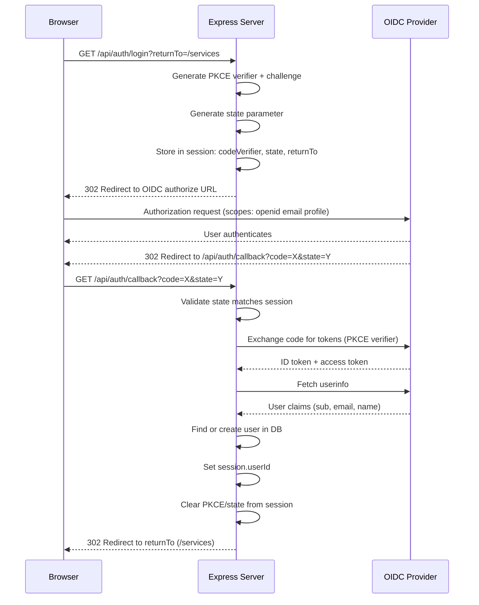
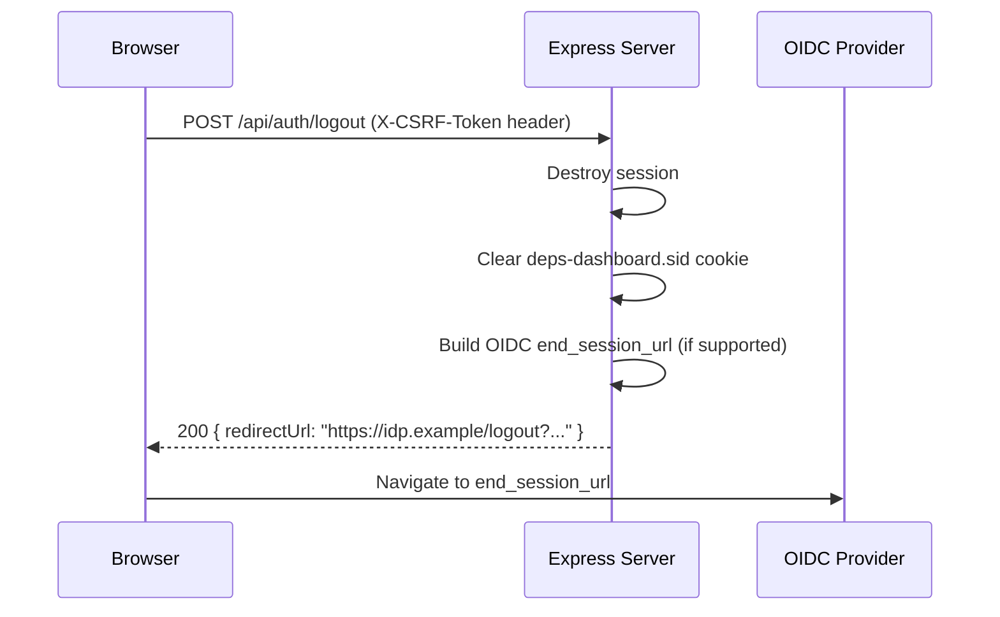

# 3. Authentication & Authorization

## 3.1 OIDC Authentication Flow **[Implemented]**

Depsera uses OpenID Connect with PKCE (Proof Key for Code Exchange) for authentication. The OIDC client is configured via environment variables.

### Login Sequence



The first user to authenticate is bootstrapped as `admin`. All subsequent users are created with role `user`.

If the OIDC provider returns updated email/name claims, the user record is updated on each login.

### Logout Sequence



If the OIDC provider does not support `end_session_endpoint`, the server returns `{ redirectUrl: "/login" }`.

### Session Data

```typescript
interface SessionData {
  userId: string;           // Set after successful auth
  codeVerifier?: string;    // PKCE — transient during login
  state?: string;           // OAuth state — transient during login
  returnTo?: string;        // Post-login redirect — transient during login
}
```

## 3.2 Auth Bypass Mode **[Removed]**

> **Removed.** Auth bypass mode was removed in favor of `LOCAL_AUTH=true` for local development. Use local auth with `ADMIN_EMAIL`/`ADMIN_PASSWORD` env vars instead. See section 3.7.

## 3.3 Session Configuration **[Implemented]**

| Property | Value |
|---|---|
| Cookie name | `deps-dashboard.sid` |
| Secure | `'auto'` (derives from `req.secure` with trust proxy) |
| HttpOnly | `true` |
| SameSite | `'lax'` (required for OIDC — `'strict'` blocks callback redirect) |
| Path | `/` |
| MaxAge | 24 hours (86,400,000 ms) |
| Store | SQLite via `better-sqlite3-session-store` |
| Expired session cleanup | Every 15 minutes |
| resave | `false` |
| saveUninitialized | `false` |

**Startup warning:** `warnInsecureCookies()` logs a warning if `NODE_ENV` is not `development` and neither `REQUIRE_HTTPS` nor `TRUST_PROXY` is configured, since the `'auto'` secure flag will resolve to `false`, sending cookies over HTTP.

## 3.4 Session Secret Validation **[Implemented]**

On startup, `validateSessionSecret()` checks `SESSION_SECRET`:

**Production (`NODE_ENV=production`)** — server refuses to start if:
- Missing entirely
- Matches a known weak default (`dev-secret-change-in-production`, `dev-session-secret-change-in-production`, `change-me-to-random-32-char-string`)
- Shorter than 32 characters

**Development** — logs warnings but allows weak defaults. Falls back to `'dev-secret-change-in-production'` if unset.

## 3.5 CSRF Protection **[Implemented]**

Uses a double-submit cookie pattern:

1. Server generates a 32-byte random hex token and sets it as the `csrf-token` cookie (`httpOnly: false`, `sameSite: lax`, `secure: req.secure`)
2. Client reads the cookie via `document.cookie` and includes it as the `X-CSRF-Token` header on mutating requests (POST, PUT, DELETE, PATCH)
3. Server middleware validates that the header value matches the cookie value
4. Returns `403 { error: "Invalid or missing CSRF token" }` on mismatch

Safe methods (GET, HEAD, OPTIONS) are exempt from validation.

## 3.6 Role-Based Access Control **[Implemented]**

### User Roles

| Role | Scope |
|---|---|
| `admin` | Full access to all resources. Bypasses team membership checks. Can manage users, teams, services, and settings. |
| `user` | Access scoped by team membership. Can view all org-wide dashboards (graph, wallboard, dashboard). |

### Team Member Roles

| Role | Scope |
|---|---|
| `lead` | Can create, edit, delete, and poll services owned by the team. |
| `member` | Read-only access to team resources. |

### Authorization Middleware

| Middleware | Checks | Sets on `req` |
|---|---|---|
| `requireAuth` | Session has userId, user exists and is active | `req.user` |
| `requireAdmin` | User role is `admin` | — |
| `requireTeamAccess` | User is admin OR member of team (from `req.params.id` or `req.params.teamId`) | `req.teamMembership` |
| `requireTeamLead` | User is admin OR team lead (from params) | `req.teamMembership` |
| `requireServiceTeamAccess` | User is admin OR member of the service's owning team (from `req.params.id`) | `req.teamMembership` |
| `requireServiceTeamLead` | User is admin OR lead of the service's owning team (from `req.params.id`) | `req.teamMembership` |
| `requireBodyTeamLead` | User is admin OR lead of team specified in `req.body.team_id` | `req.teamMembership` |

### Authorization Service Methods

In addition to middleware, the `AuthorizationService` class provides static methods for permission checks invoked inside route handlers:

| Method | Checks |
|---|---|
| `checkCanonicalOverrideAccess(user, canonicalName)` | User is admin OR team lead of any team that owns a service with a dependency matching `canonicalName`. **[Implemented]** (DPS-14b). |
| `checkDependencyTeamLeadAccess(user, dependencyId)` | User is admin OR team lead of the team that owns the service reporting this dependency. **[Implemented]** (DPS-15b). |
| `checkAliasAccess(user, aliasName)` | User is admin OR team lead of any team that owns a service with a dependency whose name matches `aliasName`. **[Implemented]**. |

### Permissions Object (returned by /api/auth/me)

```typescript
{
  canManageUsers: boolean,      // true if admin
  canManageTeams: boolean,      // true if admin
  canManageServices: boolean    // true if admin OR team lead of any team
}
```

## 3.7 Local Auth **[Implemented]**

A local authentication mode for zero-external-dependency deployment:

- Enabled via `LOCAL_AUTH=true` env var
- Passwords stored with bcryptjs (12 rounds)
- Initial admin created from `ADMIN_EMAIL` / `ADMIN_PASSWORD` env vars on first startup (when no users exist)
- `POST /api/auth/login` accepts `{ email, password }`, sets session, returns user info
- `GET /api/auth/mode` returns `{ mode: "oidc" | "local" }` (public, no auth required)
- Client login page conditionally renders local auth form or OIDC button based on `GET /api/auth/mode` **[Implemented]** (PRO-100)
- Admin can create users and reset passwords via API **[Implemented]** (PRO-101). `POST /api/users` creates a local user; `PUT /api/users/:id/password` resets password. Both gated by `requireLocalAuth`.
