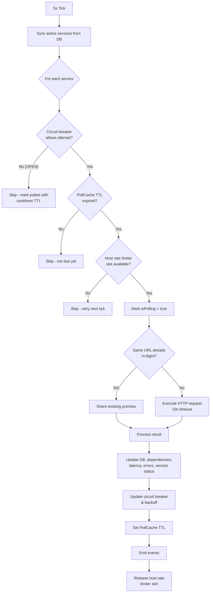
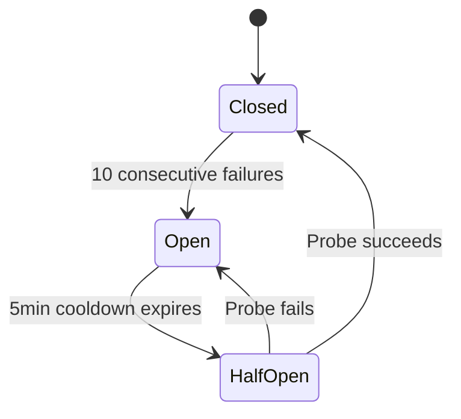

# 5. Health Polling System

**[Implemented]**

The polling system is the core engine of Depsera. It runs server-side, polling registered service health endpoints on configurable intervals with resilience patterns to handle failures gracefully.

## 5.1 Polling Lifecycle

**Tick interval:** 5 seconds (`POLL_CYCLE_MS = 5000`). Each tick evaluates which services are due for polling based on their individual `poll_interval_ms` and current backoff state.

**Per-service poll interval:** Configurable via `poll_interval_ms` (default 30,000ms, min 5,000ms, max 3,600,000ms). On success, the next poll is scheduled at this interval. On failure, the interval is extended by the backoff delay.

## 5.2 Circuit Breaker

Each service has an independent circuit breaker instance.

| Parameter | Value |
|---|---|
| Failure threshold | 10 consecutive failures |
| Cooldown period | 300,000ms (5 minutes) |
| Half-open behavior | Allows exactly 1 probe request |

**State transitions:**
- `recordSuccess()` → state = `closed`, failures = 0
- `recordFailure()` → failures++; if failures ≥ 10, state = `open`, record lastFailureTime
- `canAttempt()` → `closed`: always true; `open`: true if elapsed ≥ cooldownMs (transitions to `half-open`); `half-open`: true (allows single probe)

When the circuit is **open**, the PollCache is set with the cooldown duration as TTL, effectively blocking polling for 5 minutes.

## 5.3 Exponential Backoff

Each service has an independent backoff instance.

**Formula:** `delay = min(baseDelayMs × multiplier^attempt, maxDelayMs)`

| Parameter | Value |
|---|---|
| Base delay | 1,000ms |
| Multiplier | 2× |
| Max delay | 300,000ms (5 minutes) |

**Progression:** 1s → 2s → 4s → 8s → 16s → 32s → 64s → 128s → 256s → 300s (capped)

On success, the backoff resets to attempt 0. On failure, the next poll TTL is `max(poll_interval_ms, backoff_delay)`.

## 5.4 PollCache (TTL Scheduling)

In-memory `Map<serviceId, { expiresAt: number }>`.

- `shouldPoll(serviceId)` → true if entry missing or `Date.now() >= expiresAt`
- `markPolled(serviceId, ttlMs)` → sets `expiresAt = Date.now() + ttlMs`
- `invalidate(serviceId)` → deletes entry, forcing poll on next tick

**TTL values by scenario:**
| Scenario | TTL |
|---|---|
| Successful poll | `poll_interval_ms` |
| Failed poll | `max(poll_interval_ms, backoff_delay)` |
| Circuit open | `cooldownMs` (300,000ms) |
| Endpoint changed | Cache invalidated (immediate repoll) |

## 5.5 Host Rate Limiter

Per-hostname concurrency semaphore preventing DDoS amplification.

- **Max concurrent per host:** 5 (configurable via `POLL_MAX_CONCURRENT_PER_HOST`)
- **Mechanism:** `Map<hostname, number>` tracking active poll count
- `acquire(hostname)` → increments count if < max, returns boolean
- `release(hostname)` → decrements count; removes entry if ≤ 0
- **Hostname extraction:** `new URL(url).hostname`

Services that cannot acquire a slot are skipped this tick and automatically retried on the next 5-second tick. There is no explicit retry queue.

**Fairness sort:** Before host rate limiting is applied each tick, eligible services are sorted by `lastPolled` ascending. This guarantees that least-recently-polled services (including never-polled services with `lastPolled=0`) acquire host slots first, preventing starvation when many services share a hostname.

## 5.6 Poll Deduplication

Promise coalescing for services sharing the same health endpoint URL.

- **Mechanism:** `Map<url, Promise<PollResult>>` tracking in-flight requests
- If a URL is already being polled, all services sharing that URL await the same promise
- The promise is removed from the map via `.finally()` when the request completes
- Each service maintains independent circuit breaker and backoff state despite sharing the HTTP response
- No cross-cycle caching — each tick triggers fresh requests

## 5.7 Dependency Parsing & Upsert

When a poll succeeds, the health endpoint response is parsed (proactive-deps format) and each dependency is upserted:

1. **Alias resolution:** `aliasStore.resolveAlias(dep.name)` → sets `canonical_name` if alias exists
2. **Skipped check:** If the dependency's `health.skipped` flag is `true`, the dependency is ingested as healthy (`healthy = 1`) regardless of the actual health field value, and the `skipped` column is set to `1`. The health check is not actually executed for skipped dependencies — they are simply recorded as healthy. This allows services to declare dependencies that are intentionally excluded from health evaluation without affecting overall health status.
3. **Upsert:** INSERT or UPDATE on `dependencies` table (conflict key: `service_id, name`). All parsed fields — including `contact`, `checkDetails`, and `skipped` — are serialized with `JSON.stringify()` and persisted. The ON CONFLICT clause updates `contact` from polled data each cycle (`contact = excluded.contact`), so contact reflects the latest poll. Missing contact → `null` in DB. Returns whether the dependency is new and whether health changed.
4. **Status change detection:** If `healthy` value changed, `last_status_change` is updated and a `STATUS_CHANGE` event is emitted.
5. **Error history:** Deduplication logic — only records if the error state changed:
   - Healthy → only record if previous entry was an error (records recovery with null error)
   - Unhealthy → only record if no previous entry, previous was recovery, or error JSON changed
   - When a dependency is unhealthy but provides no `error` object (common for external deps and schema-mapped services), a synthetic marker (`{"unhealthy":true}`) is used as the error value with a default `"Unhealthy"` error message. This ensures timeline events are always recorded for unhealthy transitions. If an `errorMessage` is provided without an `error` object, the original message is preserved.
6. **Latency history:** Records data point if `latency_ms > 0`
7. **Schema mapping warnings:** When using a custom `SchemaMapping`, items that cannot be parsed (missing `name`, unresolvable `healthy`, non-object entries) are skipped and the reason is collected as a deduplicated warning. Warnings are stored as a JSON array in `services.poll_warnings` and cleared on each poll cycle. They are surfaced in the Poll Issues section of the service detail page and aggregated on the dashboard.

### Parsed Fields

The `DependencyParser.parseItem()` method extracts the following optional fields from each dependency object in the proactive-deps response:

| Field | Type | Validation | Notes |
|---|---|---|---|
| `checkDetails` | `Record<string, unknown>` | Must be a non-null object | Arbitrary check metadata |
| `contact` | `Record<string, unknown>` | Must be a non-null object | Arbitrary contact info (e.g., email, Slack channel). Non-object values are silently ignored. |

Both fields follow the same pattern: present and valid → included in `ProactiveDepsStatus`; missing or invalid type → `undefined`.

## 5.8 Events

| Event | Emitted When | Payload |
|---|---|---|
| `status:change` | Dependency healthy ↔ unhealthy | serviceId, serviceName, dependencyName, previousHealthy, currentHealthy, timestamp |
| `poll:complete` | Poll finishes (success or failure) | serviceId, success, dependenciesUpdated, statusChanges[], error?, warnings?, latencyMs |
| `poll:error` | Poll fails | serviceId, serviceName, error |
| `service:started` | Service added to polling | serviceId, serviceName |
| `service:stopped` | Service removed from polling | serviceId, serviceName |
| `circuit:open` | Circuit transitions to open | serviceId, serviceName |
| `circuit:close` | Circuit closes from half-open | serviceId, serviceName |

## 5.9 Constants Summary

| Constant | Value | Location |
|---|---|---|
| POLL_CYCLE_MS | 5,000ms | HealthPollingService |
| Circuit failure threshold | 10 | CircuitBreaker |
| Circuit cooldown | 300,000ms (5 min) | CircuitBreaker |
| Backoff base delay | 1,000ms | backoff.ts |
| Backoff multiplier | 2× | backoff.ts |
| Backoff max delay | 300,000ms (5 min) | backoff.ts |
| Poll HTTP timeout | 10,000ms | ServicePoller |
| Default poll interval | 30,000ms | services table default |
| Min poll interval | 5,000ms | API validation |
| Max poll interval | 3,600,000ms (1 hr) | API validation |
| Host concurrency limit | 5 | HostRateLimiter (env: `POLL_MAX_CONCURRENT_PER_HOST`) |
