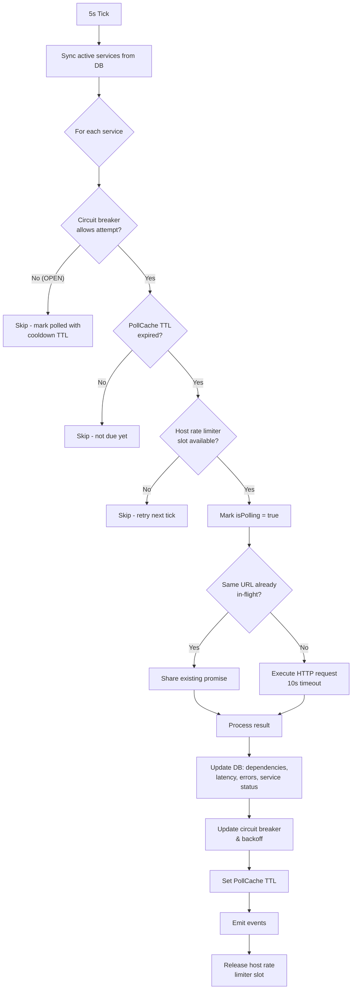
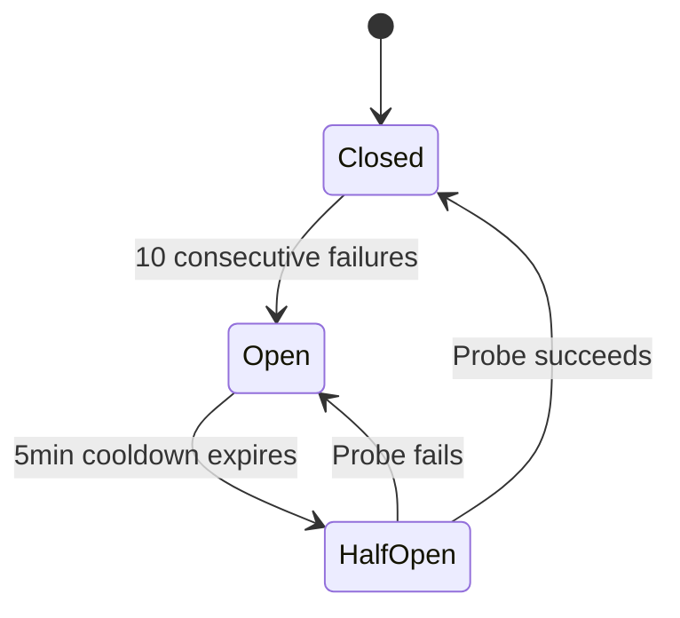
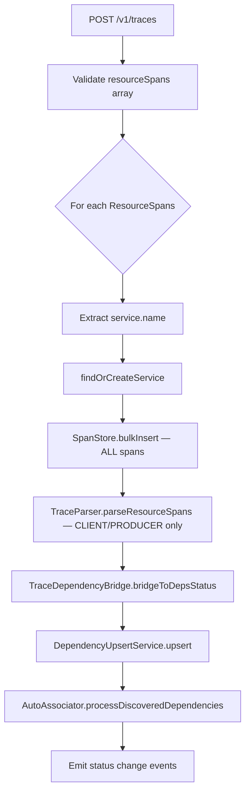

# 5. Health Polling System

**[Implemented]**

The polling system is the core engine of Depsera. It runs server-side, polling registered service health endpoints on configurable intervals with resilience patterns to handle failures gracefully.

## 5.1 Polling Lifecycle


```mermaid
flowchart TD
    A[5s Tick] --> B[Sync active services from DB]
    B --> C{For each service}
    C --> D{Circuit breaker<br>allows attempt?}
    D -- No (OPEN) --> E[Skip - mark polled with<br>cooldown TTL]
    D -- Yes --> F{PollCache TTL<br>expired?}
    F -- No --> G[Skip - not due yet]
    F -- Yes --> H{Host rate limiter<br>slot available?}
    H -- No --> I[Skip - retry next tick]
    H -- Yes --> J[Mark isPolling = true]
    J --> K{Same URL already<br>in-flight?}
    K -- Yes --> L[Share existing promise]
    K -- No --> M[Execute HTTP request<br>10s timeout]
    L --> N[Process result]
    M --> N
    N --> O[Update DB: dependencies,<br>latency, errors, service status]
    O --> P[Update circuit breaker<br>& backoff]
    P --> Q[Set PollCache TTL]
    Q --> R[Emit events]
    R --> S[Release host rate<br>limiter slot]
```

**Tick interval:** 5 seconds (`POLL_CYCLE_MS = 5000`). Each tick evaluates which services are due for polling based on their individual `poll_interval_ms` and current backoff state.

**Per-service poll interval:** Configurable via `poll_interval_ms` (default 30,000ms, min 5,000ms, max 3,600,000ms). On success, the next poll is scheduled at this interval. On failure, the interval is extended by the backoff delay.

## 5.2 Circuit Breaker

Each service has an independent circuit breaker instance.


```mermaid
stateDiagram-v2
    [*] --> Closed
    Closed --> Open: 10 consecutive failures
    Open --> HalfOpen: 5min cooldown expires
    HalfOpen --> Closed: Probe succeeds
    HalfOpen --> Open: Probe fails
```

| Parameter | Value |
|---|---|
| Failure threshold | 10 consecutive failures |
| Cooldown period | 300,000ms (5 minutes) |
| Half-open behavior | Allows exactly 1 probe request |

**State transitions:**
- `recordSuccess()` → state = `closed`, failures = 0
- `recordFailure()` → failures++; if failures ≥ 10, state = `open`, record lastFailureTime
- `canAttempt()` → `closed`: always true; `open`: true if elapsed ≥ cooldownMs (transitions to `half-open`); `half-open`: true (allows single probe)

When the circuit is **open**, the PollCache is set with the cooldown duration as TTL, effectively blocking polling for 5 minutes.

## 5.3 Exponential Backoff

Each service has an independent backoff instance.

**Formula:** `delay = min(baseDelayMs × multiplier^attempt, maxDelayMs)`

| Parameter | Value |
|---|---|
| Base delay | 1,000ms |
| Multiplier | 2× |
| Max delay | 300,000ms (5 minutes) |

**Progression:** 1s → 2s → 4s → 8s → 16s → 32s → 64s → 128s → 256s → 300s (capped)

On success, the backoff resets to attempt 0. On failure, the next poll TTL is `max(poll_interval_ms, backoff_delay)`.

## 5.4 PollCache (TTL Scheduling)

In-memory `Map<serviceId, { expiresAt: number }>`.

- `shouldPoll(serviceId)` → true if entry missing or `Date.now() >= expiresAt`
- `markPolled(serviceId, ttlMs)` → sets `expiresAt = Date.now() + ttlMs`
- `invalidate(serviceId)` → deletes entry, forcing poll on next tick

**TTL values by scenario:**
| Scenario | TTL |
|---|---|
| Successful poll | `poll_interval_ms` |
| Failed poll | `max(poll_interval_ms, backoff_delay)` |
| Circuit open | `cooldownMs` (300,000ms) |
| Endpoint changed | Cache invalidated (immediate repoll) |

## 5.5 Host Rate Limiter

Per-hostname concurrency semaphore preventing DDoS amplification.

- **Max concurrent per host:** 5 (configurable via `POLL_MAX_CONCURRENT_PER_HOST`)
- **Mechanism:** `Map<hostname, number>` tracking active poll count
- `acquire(hostname)` → increments count if < max, returns boolean
- `release(hostname)` → decrements count; removes entry if ≤ 0
- **Hostname extraction:** `new URL(url).hostname`

Services that cannot acquire a slot are skipped this tick and automatically retried on the next 5-second tick. There is no explicit retry queue.

**Fairness sort:** Before host rate limiting is applied each tick, eligible services are sorted by `lastPolled` ascending. This guarantees that least-recently-polled services (including never-polled services with `lastPolled=0`) acquire host slots first, preventing starvation when many services share a hostname.

## 5.6 Poll Deduplication

Promise coalescing for services sharing the same health endpoint URL.

- **Mechanism:** `Map<url, Promise<PollResult>>` tracking in-flight requests
- If a URL is already being polled, all services sharing that URL await the same promise
- The promise is removed from the map via `.finally()` when the request completes
- Each service maintains independent circuit breaker and backoff state despite sharing the HTTP response
- No cross-cycle caching — each tick triggers fresh requests

## 5.7 Format-Aware Polling **[Implemented]**

The polling system supports multiple health endpoint formats via the `health_endpoint_format` field on each service.

### Service Format Dispatch

| Format | Polling Behavior | Accept Header | Response Parsing |
|---|---|---|---|
| `default` | Poll endpoint, parse JSON array | `application/json` | `DependencyParser` (proactive-deps format) |
| `schema` | Poll endpoint, parse JSON with schema mapping | `application/json` | `DependencyParser` → `SchemaMapper` |
| `prometheus` | Poll endpoint, parse text | `text/plain; version=0.0.4` | `DependencyParser` → `PrometheusParser` |
| `otlp` | **Not polled** (push-only) | N/A | Receives data via `POST /v1/metrics` and `POST /v1/traces` |

### OTLP Service Exclusion

OTLP services are push-only and are excluded from the polling lifecycle at multiple levels:

- `HealthPollingService.startService()`: skips services with `health_endpoint_format === 'otlp'`, does not create a poller or emit `SERVICE_STARTED`
- `DependencyParser.parse()`: throws if `format === 'otlp'` (safety check — should never be called)
- `ServicePoller`: never instantiated for OTLP services

### OtlpParser

Parses OTLP `ExportMetricsServiceRequest` JSON payloads into dependency statuses. Used by the OTLP receiver (`POST /v1/metrics`), not by the polling system.

**Public methods:**

- `parse(request)` — parses a full OTLP request, returns `OtlpParseResult[]` (one per resource)
- `parseResourceMetrics(rm, config?)` — parses a single `ResourceMetrics` block with optional `MetricSchemaConfig`
- `extractServiceName(rm)` — extracts `service.name` from resource attributes

**Custom metric/attribute names via MetricSchemaConfig:** The OTLP receiver loads `schema_config` per-service and passes it to `parseResourceMetrics()`. Default metric names (`dependency.health.status`, etc.) and attribute names (`dependency.name`, etc.) can be overridden per-service. See the OTLP metric mapping tables in the API reference and the `MetricSchemaConfig` section in the data model spec.

**Healthy value comparison:** Health status is determined by comparing the `healthy` metric value against a configurable `healthy_value` (default: `1`). The `healthy_value` can be overridden per-service via the `MetricSchemaConfig`.

**Timestamp handling:** `timeUnixNano` from OTLP data points is converted from nanoseconds to an ISO 8601 string for `lastChecked`. Falls back to `Date.now()` if the timestamp is missing or zero.

### OTLP Receiver Endpoint

The OTLP receiver (`POST /v1/metrics`) is documented in the API reference (section 4.18). Key implementation details relevant to the polling system:

**Middleware chain:** `express.json (1MB limit)` → `OTLP global rate limit (600/min per IP)` → `requireApiKeyAuth` → `per-key rate limit (token bucket)` → `usage tracking` → `OTLP router`.

**Auto-registration:** When the receiver encounters a `service.name` not yet registered for the authenticated team, it auto-creates a service with `health_endpoint_format = 'otlp'`, `health_endpoint = ''`, `is_active = 1`, `poll_interval_ms = 0`. These services are excluded from the polling lifecycle.

**Format mismatch:** If a service exists but has a different `health_endpoint_format`, the receiver logs a warning but continues processing. It does not overwrite the existing format.

**Response format:** Returns an OTLP-standard `partialSuccess` response. On success: `{ partialSuccess: { rejectedDataPoints: 0, errorMessage: "" } }`. Warnings from parsing are aggregated into the `errorMessage` field. On rate limit rejection (429): `{ partialSuccess: { rejectedDataPoints: 0, errorMessage: "Rate limit exceeded..." } }`.

**Per-key rate limiting:** See section 9.4 in the security spec for details on the token bucket algorithm, configuration, and response headers.

**Usage tracking:** Every request (accepted or rejected) increments `push_count` in dual-granularity buckets (minute + hour). Rejected requests additionally increment `rejected_count`. Usage data is accumulated in-memory and flushed to the database every `OTLP_USAGE_FLUSH_INTERVAL_MS` (default 5s).

### Histogram and Sum Metric Processing **[Implemented]**

The OTLP parser processes three metric types: gauges (existing), histograms (new), and sums (new).

**Histogram processing:** When `metric.histogram?.dataPoints` is present, each data point's bucket boundaries and counts are passed to `computePercentiles()` in `server/src/utils/histogramPercentiles.ts`. This produces percentile latency (p50, p95, p99) via linear interpolation within histogram buckets. The `metric.unit` field is read for automatic unit detection (seconds → milliseconds conversion).

**Sum processing:** When `metric.sum?.dataPoints` is present:
- Non-monotonic sums (`isMonotonic === false`) are treated as gauge values and extracted directly
- Monotonic sums store raw count as `requestCount`

**Percentile computation algorithm:**
1. Walk cumulative bucket counts
2. Find the bucket where cumulative count crosses `count × percentile`
3. Linearly interpolate within that bucket
4. Edge cases: empty histogram (count=0) returns zeros; overflow bucket capped at last explicit bound

**Integration with upsert pipeline:** When histogram-derived percentile data exists in `ProactiveDepsStatus.health.percentiles`, `DependencyUpsertService` calls `latencyStore.recordWithPercentiles()` with source `'otlp_histogram'` instead of the standard `latencyStore.record()`.

**Latency bucket queries:** `getLatencyBuckets()` and `getAggregateLatencyBuckets()` include `ROUND(AVG(p50_ms))`, `ROUND(AVG(p95_ms))`, `ROUND(AVG(p99_ms))` in the SELECT for time-bucketed percentile averages.

### Trace Ingestion **[Implemented]**

The trace ingestion system receives OTLP trace payloads via `POST /v1/traces`, stores all spans, and automatically discovers dependencies from CLIENT and PRODUCER spans.


```mermaid
flowchart TD
    A[POST /v1/traces] --> B[Validate resourceSpans array]
    B --> C{For each ResourceSpans}
    C --> D[Extract service.name]
    D --> E[findOrCreateService]
    E --> F[SpanStore.bulkInsert — ALL spans]
    F --> G[TraceParser.parseResourceSpans — CLIENT/PRODUCER only]
    G --> H[TraceDependencyBridge.bridgeToDepsStatus]
    H --> I[DependencyUpsertService.upsert]
    I --> J[AutoAssociator.processDiscoveredDependencies]
    J --> K[Emit status change events]
```

**Middleware chain:** `express.json (2MB limit)` → `OTLP global rate limit` → `requireApiKeyAuth` → `per-key rate limit` → `usage tracking` → `trace router`.

**Response format:** OTLP-standard `{ partialSuccess: { rejectedDataPoints, errorMessage } }`.

#### TraceParser

`server/src/services/polling/TraceParser.ts` — Parses OTLP `ExportTraceServiceRequest` JSON payloads into per-service dependency results. Only CLIENT and PRODUCER spans produce dependencies (outbound calls).

**Public API:**
- `parseRequest(data: unknown): TraceDependencyResult[]` — parses full request
- `parseResourceSpans(rs: OtlpResourceSpans): TraceDependencyResult` — parses single resource
- `extractServiceName(rs: OtlpResourceSpans): string | undefined` — reuses OtlpParser pattern

**Target name resolution chain** (first non-empty wins):
1. `peer.service` attribute
2. `db.system` / `db.system.name`
3. `messaging.system`
4. `rpc.system` / `rpc.system.name`
5. `server.address`
6. Hostname extracted from `url.full`

**Dependency type inference:**
| Attribute | Inferred Type |
|---|---|
| `db.system` = redis/memcached | `cache` |
| `db.system` (other) | `database` |
| `messaging.system` | `message_queue` |
| `rpc.system` = grpc | `grpc` |
| `http.request.method` | `rest` |
| (default) | `other` |

**Auto-generated descriptions:**
- HTTP: `"{method} {host}{path}"`
- DB: `"{op} {ns}.{collection}"`
- Messaging: `"{op} {destination}"`
- gRPC: `"{rpc.method}"`

**Deduplication:** Dependencies are deduplicated by target name within a single push — latency is averaged, error uses any-error-wins logic.

**Output types:**
```typescript
interface TraceDependency {
  targetName: string;
  type: DependencyType;
  latencyMs: number;
  isError: boolean;
  spanKind: number;
  description: string;
  attributes: Record<string, string | number | boolean>;
}

interface TraceDependencyResult {
  serviceName: string;
  dependencies: TraceDependency[];
}
```

#### TraceDependencyBridge

`server/src/services/polling/TraceDependencyBridge.ts` — Converts `TraceDependency[]` to `ProactiveDepsStatus[]` for the existing upsert pipeline.

**Public API:** `bridgeToDepsStatus(traceDeps: TraceDependency[]): TraceBridgedDepsStatus[]`

**Mapping:**
- `isError: false` → `health.state = 0` (OK), `health.code = 200`
- `isError: true` → `health.state = 2` (CRITICAL), `health.code = 500`
- Span duration → `health.latency`
- All outputs include `discovery_source: 'otlp_trace'`

#### AutoAssociator

`server/src/services/polling/AutoAssociator.ts` — Automatically links trace-discovered dependencies to registered services.

**Public API:** `processDiscoveredDependencies(sourceService: Service, dependencies: ProactiveDepsStatus[], teamId: string): void`

**Matching strategy:**
1. Case-insensitive exact name match against team services
2. Canonical name resolution via `DependencyAliasStore`, then match service name

**Association type mapping:**
| Dependency Type | Association Type |
|---|---|
| `database` | `database` |
| `cache` | `cache` |
| `message_queue` | `message_queue` |
| `rest` or `grpc` | `api_call` |
| (default) | `other` |

**Safety rules:**
- Skips self-links (source service = target service)
- Skips already-associated pairs (including dismissed — never re-suggests)
- Catches UNIQUE constraint violations as no-ops (race condition safety)
- Creates associations with `is_auto_suggested: true`

#### Shared Service Resolution

`server/src/services/polling/otlpServiceResolver.ts` — Shared `findOrCreateService()` helper used by both `/v1/metrics` and `/v1/traces` routes. Extracted from the metrics route for reuse. Auto-creates services with `health_endpoint_format = 'otlp'`, `health_endpoint = ''`, `is_active = 1`, `poll_interval_ms = 0`.

### PrometheusParser

Parses Prometheus text exposition format (`metric_name{labels} value`) into `ProactiveDepsStatus[]`.

**Default metric mapping (customizable via MetricSchemaConfig):**

| Prometheus Metric | Maps To | Notes |
|---|---|---|
| `dependency_health_status` | `health.state` | HealthState 0-2 |
| `dependency_health_healthy` | `healthy` | 0 or 1 |
| `dependency_health_latency_ms` | `health.latency` | Milliseconds (default). Set `latency_unit: 's'` to convert seconds → ms. |
| `dependency_health_code` | `health.code` | HTTP status code |
| `dependency_health_check_skipped` | `health.skipped` | |

**Default label mapping (customizable via MetricSchemaConfig):** `name` (required), `type`, `impact`, `description`, `error_message` (all optional).

**Custom metric/label names via MetricSchemaConfig:**

When a service has a `MetricSchemaConfig` in its `schema_config` column, the parser merges user-provided metric and label mappings into the defaults. For example, if a user maps `{ "my_latency_metric": "latency" }`, the default `dependency_health_latency_ms` entry is removed and `my_latency_metric` is used instead. See the `MetricSchemaConfig` section in the data model spec.

**Latency handling:** Latency is treated as milliseconds by default (no conversion). When `latency_unit` is set to `'s'` in the `MetricSchemaConfig`, the raw value is multiplied by 1000 to convert seconds to milliseconds.

**Parsing rules:**
- `# HELP` and `# TYPE` comment lines are skipped
- Lines parsed as `metric_name{label1="val1",label2="val2"} value`
- Dependencies are grouped by `name` label and metrics are merged per dependency
- Missing `name` label produces a warning, line is skipped
- Unknown metric names are silently ignored
- `lastChecked` defaults to current time (no timestamp in text format)

## 5.8 Dependency Parsing & Upsert

When a poll succeeds, the health endpoint response is parsed (proactive-deps format) and each dependency is upserted:

1. **Alias resolution:** `aliasStore.resolveAlias(dep.name)` → sets `canonical_name` if alias exists
2. **Skipped check:** If the dependency's `health.skipped` flag is `true`, the dependency is ingested as healthy (`healthy = 1`) regardless of the actual health field value, and the `skipped` column is set to `1`. The health check is not actually executed for skipped dependencies — they are simply recorded as healthy. This allows services to declare dependencies that are intentionally excluded from health evaluation without affecting overall health status.
3. **Upsert:** INSERT or UPDATE on `dependencies` table (conflict key: `service_id, name`). All parsed fields — including `contact`, `checkDetails`, and `skipped` — are serialized with `JSON.stringify()` and persisted. The ON CONFLICT clause updates `contact` from polled data each cycle (`contact = excluded.contact`), so contact reflects the latest poll. Missing contact → `null` in DB. Returns whether the dependency is new and whether health changed.
4. **Status change detection:** If `healthy` value changed, `last_status_change` is updated and a `STATUS_CHANGE` event is emitted.
5. **Error history:** Deduplication logic — only records if the error state changed:
   - Healthy → only record if previous entry was an error (records recovery with null error)
   - Unhealthy → only record if no previous entry, previous was recovery, or error JSON changed
   - When a dependency is unhealthy but provides no `error` object (common for external deps and schema-mapped services), a synthetic marker (`{"unhealthy":true}`) is used as the error value with a default `"Unhealthy"` error message. This ensures timeline events are always recorded for unhealthy transitions. If an `errorMessage` is provided without an `error` object, the original message is preserved.
6. **Latency history:** Records data point if `latency_ms > 0`
7. **Schema mapping warnings:** When using a custom `SchemaMapping`, items that cannot be parsed (missing `name`, unresolvable `healthy`, non-object entries) are skipped and the reason is collected as a deduplicated warning. Warnings are stored as a JSON array in `services.poll_warnings` and cleared on each poll cycle. They are surfaced in the Poll Issues section of the service detail page and aggregated on the dashboard.

### Parsed Fields

The `DependencyParser.parseItem()` method extracts the following optional fields from each dependency object in the proactive-deps response:

| Field | Type | Validation | Notes |
|---|---|---|---|
| `checkDetails` | `Record<string, unknown>` | Must be a non-null object | Arbitrary check metadata |
| `contact` | `Record<string, unknown>` | Must be a non-null object | Arbitrary contact info (e.g., email, Slack channel). Non-object values are silently ignored. |

Both fields follow the same pattern: present and valid → included in `ProactiveDepsStatus`; missing or invalid type → `undefined`.

## 5.9 Events

| Event | Emitted When | Payload |
|---|---|---|
| `status:change` | Dependency healthy ↔ unhealthy | serviceId, serviceName, dependencyName, previousHealthy, currentHealthy, timestamp |
| `poll:complete` | Poll finishes (success or failure) | serviceId, success, dependenciesUpdated, statusChanges[], error?, warnings?, latencyMs |
| `poll:error` | Poll fails | serviceId, serviceName, error |
| `service:started` | Service added to polling | serviceId, serviceName |
| `service:stopped` | Service removed from polling | serviceId, serviceName |
| `circuit:open` | Circuit transitions to open | serviceId, serviceName |
| `circuit:close` | Circuit closes from half-open | serviceId, serviceName |

## 5.10 Constants Summary

| Constant | Value | Location |
|---|---|---|
| POLL_CYCLE_MS | 5,000ms | HealthPollingService |
| Circuit failure threshold | 10 | CircuitBreaker |
| Circuit cooldown | 300,000ms (5 min) | CircuitBreaker |
| Backoff base delay | 1,000ms | backoff.ts |
| Backoff multiplier | 2× | backoff.ts |
| Backoff max delay | 300,000ms (5 min) | backoff.ts |
| Poll HTTP timeout | 10,000ms | ServicePoller |
| Default poll interval | 30,000ms | services table default |
| Min poll interval | 5,000ms | API validation |
| Max poll interval | 3,600,000ms (1 hr) | API validation |
| Host concurrency limit | 5 | HostRateLimiter (env: `POLL_MAX_CONCURRENT_PER_HOST`) |
