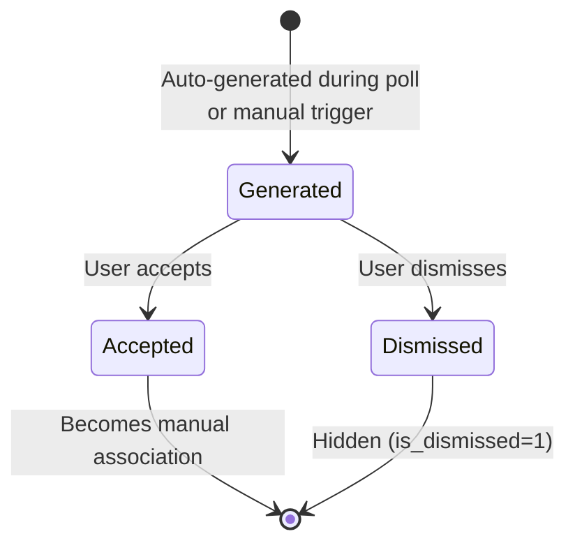

# 7. Auto-Suggestion Engine

**[Implemented]**

The suggestion engine automatically proposes dependency-to-service associations using 5 matching strategies.

## 7.1 Matching Strategies

Strategies are evaluated in order. For each service, the **highest-scoring** match from any strategy is kept.

| Priority | Strategy | Confidence | Logic |
|---|---|---|---|
| 1 | Exact Name | 100 | `depName === serviceName` (case-insensitive) |
| 2 | Hostname Match | 90 | Hostnames from dependency name and service health endpoint match |
| 3 | Contains Match | 80 | Either name contains the other (case-insensitive) |
| 4 | Token Overlap | 50–90 | Token sets overlap ratio × 40 + 50 |
| 5 | Levenshtein | 50–80 | String similarity × 30 + 50 (min 60% similarity threshold) |

**Minimum confidence threshold:** 50. Matches below this are discarded.

## 7.2 Token Overlap Algorithm

1. Split both names on `-_./` and spaces
2. Filter out single-character tokens
3. Calculate overlap ratio: `overlap / min(set1.size, set2.size)`
4. Confidence: `round(50 + ratio × 40)`

Example: `"user-api-gateway"` vs `"user-api"` → tokens `{user, api, gateway}` vs `{user, api}` → overlap 2, min size 2 → ratio 1.0 → confidence 90.

## 7.3 Levenshtein Algorithm

1. Calculate Levenshtein edit distance between names (case-insensitive)
2. Similarity: `1 - distance / max(len1, len2)`
3. If similarity < 0.6 → no match
4. Confidence: `round(50 + similarity × 30)`

## 7.4 Association Type Inference

The `AssociationTypeInferencer` classifies dependencies by keyword matching in the dependency name:

| Type | Keywords |
|---|---|
| `database` | db, database, postgres, mysql, mongo, redis, sqlite, sql, dynamodb, cassandra, oracle |
| `cache` | cache, redis, memcache, memcached, elasticache |
| `message_queue` | queue, kafka, rabbit, rabbitmq, sqs, pubsub, message, mq, amqp, eventbus, sns |
| `api_call` | api, service, http, rest, grpc, graphql, endpoint |
| `other` | (default fallback) |

Evaluated in order: database → cache → message_queue → api_call → other.

## 7.5 Suggestion Lifecycle

Suggestions are stored as `dependency_associations` rows with `is_auto_suggested = 1`. Accepting a suggestion sets `is_auto_suggested = 0`. Dismissing sets `is_dismissed = 1`.
